# 第一章实验报告

## 实验目的

+ 熟悉基于 OpenWrt 的无线接入点（AP）配置
+ 为第二章、第三章和第四章实验准备好「无线软 AP」环境

## 实验环境

+ 可以开启监听模式、AP 模式和数据帧注入功能的 USB 无线网卡
+ Virtualbox

## 实验要求

+ 对照 [第一章 实验](https://c4pr1c3.github.io/cuc-mis/chap0x01/exp.html) `无线路由器/无线接入点（AP）配置` 列的功能清单，找到在 OpenWrt 中的配置界面并截图证明；
+ 记录环境搭建步骤；
+ 如果 USB 无线网卡能在 `OpenWrt` 中正常工作，则截图证明；
+ 如果 USB 无线网卡不能在 `OpenWrt` 中正常工作，截图并分析可能的故障原因并给出可能的解决方法。

## `OpenWrt` on VirtualBox

### 环境配置

+ `VirtualBox`的环境变量配置；
+ `wget.exe`下载并将其放到`git`的`bin`目录下。
+ 下载`dd`工具包。

### 脚本安装`OpenWrt`

环境：windows10 + git bash

```
git clone https://gitee.com/c4pr1c3/cuc-mis-ppt

cd cuc-mis-ppt/exp/chap0x01

bash setup-vm.sh
```

####  脚本分析(做了少量修改，可在windows环境中一键安装openwrt)

```bash
#!/usr/bin/env bash

VER="19.07.5" # openwrt version
VDI_BASE="openwrt-x86-64-combined-squashfs.vdi"

shasum -c img.sha256.sum  
  #kate:
  # -c  从文件中读取SHA1 的校验值并予以检查
  # -q  don't print OK for each successfully verified file （kali里有该参数，ubuntu16.4里无改参数）
  # 在ubuntu里，如果加上-q，则每次该命令会执行出错，从而无论本地是否已经下载过下面的镜像，都会重新下载。
  # 标准输出重定向到 /dev/null , 2表示标准错误输出，重定向到 &1 ，1表示标准输出。即：标准错误输出也重定向到 /dev/null
if [[ $? -ne 0 ]];then
  # kate:
  # $? 最后运行的命令执行代码的返回值。即shasum的返回值。 
  # -ne ： 不等于
  # shasum执行成功返回0

  # 下载固件
  wget https://downloads.openwrt.org/releases/$VER/targets/x86/64/openwrt-$VER-x86-64-combined-squashfs.img.gz -O openwrt-x86-64-combined-squashfs.img.gz
  # kate:
  # wget : 非交互式的网络文件下载工具
  # -O : 将文档写入 FILE/重命名
  # 若官方网站链接发生变化，可以在google搜索文件名。

  # 解压缩
  gzip -d openwrt-x86-64-combined-squashfs.img.gz
  # kate:
  # gzip : Compress or uncompress FILEs
fi

shasum -c vdi.sha256.sum
if [[ $? -ne 0 ]];then
  # img 格式转换为 Virtualbox 虚拟硬盘格式 vdi
  VBoxManage convertfromraw --format VDI openwrt-x86-64-combined-squashfs.img "$VDI_BASE"
  # 新建虚拟机选择「类型」 Linux / 「版本」Linux 2.6 / 3.x / 4.x (64-bit)，填写有意义的虚拟机「名称」
  # 内存设置为 256 MB
  # 使用已有的虚拟硬盘文件 - 「注册」新虚拟硬盘文件选择刚才转换生成的 .vdi 文件


  if [[ $? -eq 1 ]];then
    # 上述代码执行失败，则执行下述代码：将源img镜像拷贝一份，并给其一个新的名字。
    # ref: https://openwrt.org/docs/guide-user/virtualization/virtualbox-vm#convert_openwrtimg_to_vbox_drive
    dd if=openwrt-x86-64-combined-squashfs.img of=openwrt-x86-64-combined-squashfs-padded.img bs=128000 conv=sync
    # dd ：用指定大小的块拷贝一个文件，并在拷贝的同时进行指定的转换
    # if=文件名：输入文件名
    # of=文件名：输出文件名
    # bs=bytes：同时设置读入/输出的块大小为bytes个字节。
    # conv=conversion：用指定的参数转换文件。
    # sync：将每个输入块填充到ibs个字节，不足部分用空（NUL）字符补齐。

    VBoxManage convertfromraw --format VDI openwrt-x86-64-combined-squashfs-padded.img "$VDI_BASE"
     # This command converts a raw disk image to an Oracle VM VirtualBox Disk Image (VDI) file.
  fi
fi

# 创建虚拟机
VM="openwrt-demo"
# VBoxManage list ostypes
if [[ $(VBoxManage list vms | cut -d ' ' -f 1 | grep -w "\"$VM\"" -c) -eq 0 ]];then
    # kate :
    # VBoxManage list vms : 列出所有的虚拟机

    # cut : Print selected parts of lines from each FILE to standard output.
    # -d : 指定分隔符
    # -f : 选取分割后的第一个

    # grep : 在每个 FILE 或是标准输入中查找 PATTERN。默认的 PATTERN 是一个基本正则表达式(缩写为 BRE)
    # -w : 强制匹配
    # -c : 只打印匹配的行数

    # 本行含义：如果版本为“openwrt-19.07.5”的虚拟机的个数为0，则继续往下执行：
  echo "vm $VM not exsits, create it ..."
  VBoxManage createvm --name $VM --ostype "Linux26_64" --register
    # VBoxManage createvm --name $VM --ostype "Linux26_64" --register --groups "/IoT"
    # VBoxManage createvm : 创建并注册一个虚拟机。 
    # --name : 指定虚拟机的名称为：openwrt-19.07.5
    # --ostype : 指定虚拟机的系统类型为：Linux26_64
    
  # 创建一个 SATA 控制器
  VBoxManage storagectl "$VM" --name "SATA" --add sata --controller IntelAHCI
  # 向该控制器安装一个「硬盘」
  ## --medium 指定本地的一个「多重加载」虚拟硬盘文件
  VBoxManage storageattach "$VM" --storagectl "SATA" --port 0 \
    --device 0 --type hdd --medium "$VDI_BASE"

  VBoxManage storagectl "$VM" --name "SATA" --remove

  # 将目标 vdi 修改为「多重加载」
  VBoxManage modifymedium disk --type multiattach "$VDI_BASE"
  # 虚拟磁盘扩容
  VBoxManage modifymedium disk --resize 10240 "$VDI_BASE"

  VBoxManage storagectl "$VM" --name "SATA" --add sata --controller IntelAHCI
  VBoxManage storageattach "$VM" --storagectl "SATA" --port 0 \
    --device 0 --type hdd --medium "$VDI_BASE"

  # 启用 USB 3.0 接口
  VBoxManage modifyvm "$VM" --usbxhci on
  # 修改虚拟机配置
  ## --memory 内存设置为 256MB
  ## --vram   显存设置为 16MB
  VBoxManage modifyvm "$VM" --memory 256 --vram 16

  # ref: https://docs.oracle.com/en/virtualization/virtualbox/6.1/user/settings-display.html
  # VMSVGA: Use this graphics controller to emulate a VMware SVGA graphics device. This is the default graphics controller for Linux guests.
  VBoxManage modifyvm "$VM" --graphicscontroller vmsvga

  # CAUTION: 虚拟机的 WAN 网卡对应的虚拟网络类型必须设置为 NAT 而不能使用 NatNetwork ，无线客户端连入无线网络后才可以正常上网
  ## 检查 NATNetwork 网络是否存在
  # natnetwork_name="NatNetwork"
  # natnetwork_count=$(VBoxManage natnetwork list | grep -c "$natnetwork_name")
  # if [[ $natnetwork_count -eq 0 ]];then
  #   VBoxManage natnetwork add --netname "$natnetwork_name" --network "10.0.2.0/24" --enable --dhcp on
  # fi

  ## 添加 Host-Only 网卡为第 1 块虚拟网卡
  ## --hostonlyadapter1 第 1 块网卡的界面名称为 vboxnet0
  ## --nictype1 第 1 块网卡的控制芯片为 Intel PRO/1000 MT 桌面 (82540EM)
  ## --nic2 nat 第 2 块网卡配置为 NAT 模式
  VBoxManage modifyvm "$VM" --nic1 "hostonly" --nictype1 "82540EM" --hostonlyadapter1 "vboxnet0"
  VBoxManage modifyvm "$VM" --nic2 nat 
fi
```

### 手动安装`openwrt`

+ 在`https://downloads.openwrt.org/releases/19.07.5/targets/x86/64/`中下载`openwrt-19.07.5-x86-64-combined-squashfs.img.gz`。

  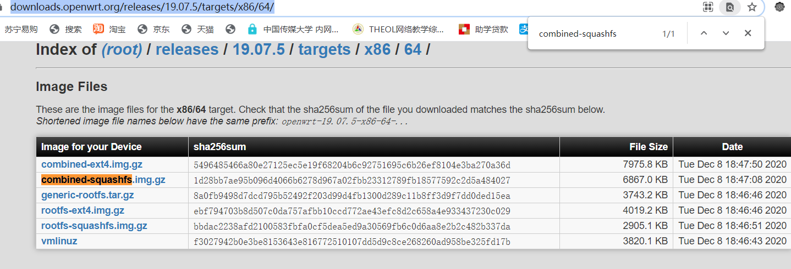

+ 使用`gzip -d`在`git bash`中解压缩刚下载的文件。

  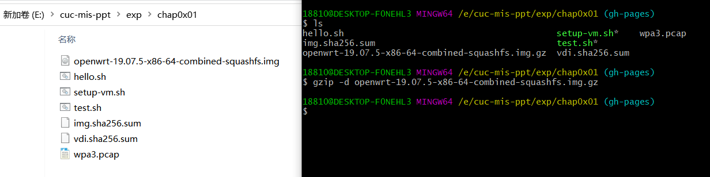

+ 使用下述命令将`img`文件转换成`vdi`文件。

  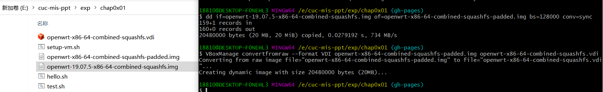

+ 磁盘扩容

  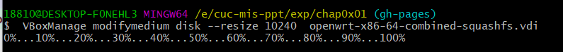

  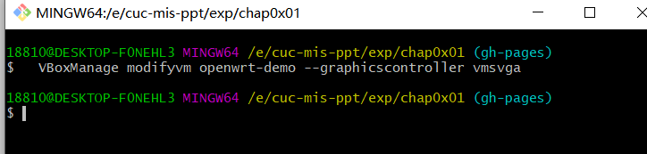

+ 在`virtualBox`中新建虚拟机，并选择[使用已有虚拟硬盘]，并注册刚才生成的`vdi`。得到新的虚拟机`openwrt-demo`。

  ​	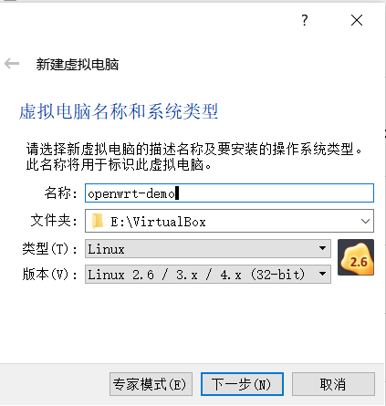

  ​	

+ 进行一些配置，如：设置多重加载、NAT+Host only双网卡、修改内存大小、显存大小、USB设备配置等。

  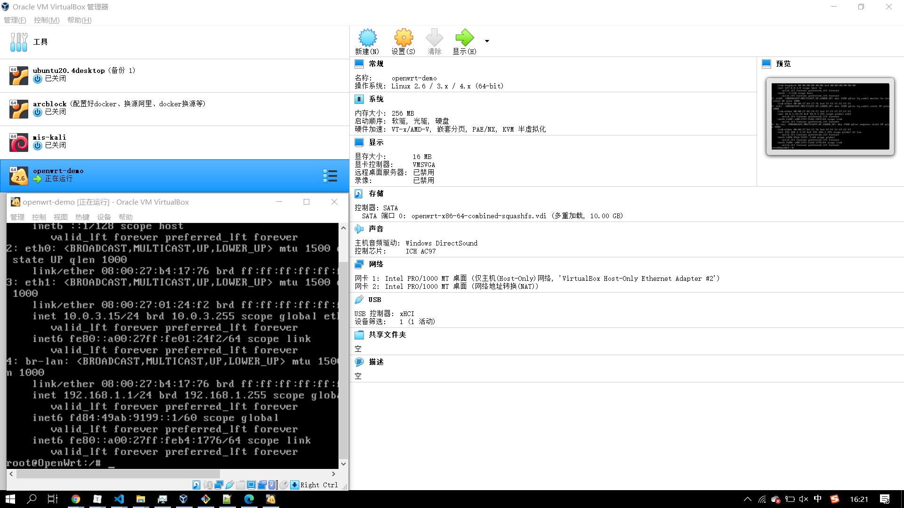

### 无线网卡配置(补充)

插入USB无线网卡，检测下述命令：`iw dev`,`iw phy`,`lsusb`

+ `usb`端口设置：

  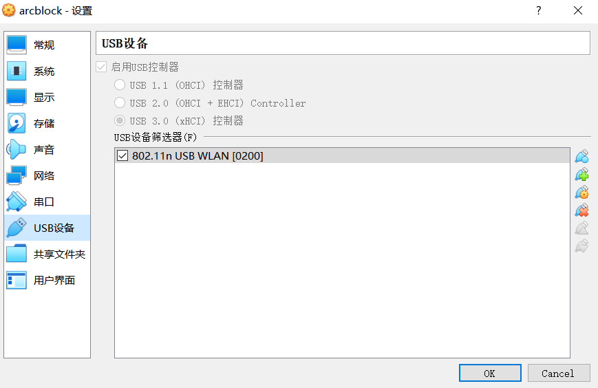

注意：重装virtualbox 需要安装 extension pack，才能更改上面的USB控制器。

+ 可以采用下面的三条指令检测虚拟机是否可以正常的识别网卡。

  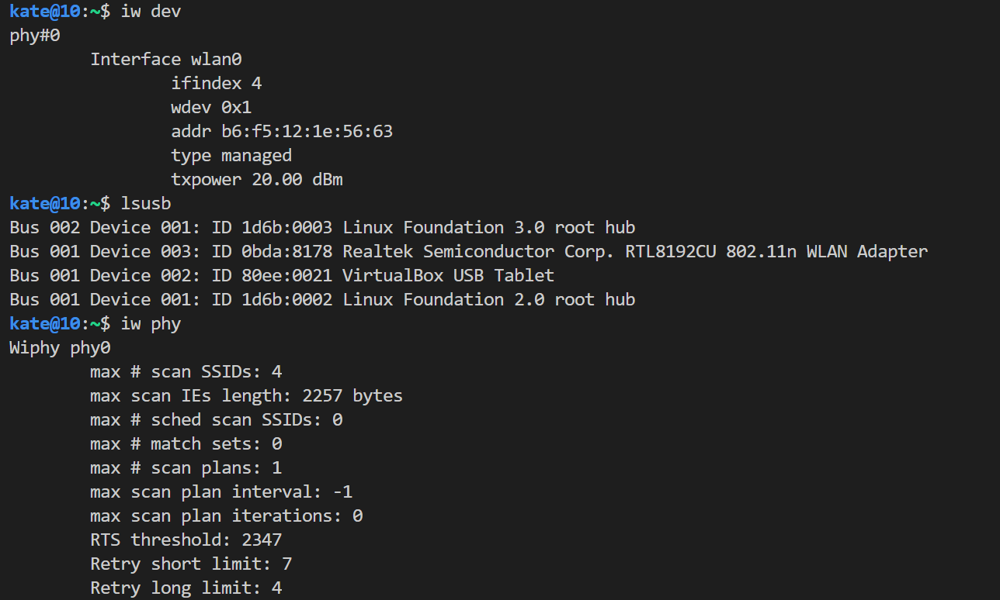

+ 使用`sudo airodump-ng wlan0 -c 11 -w demo-20210324 --beacons` ： 抓包。

  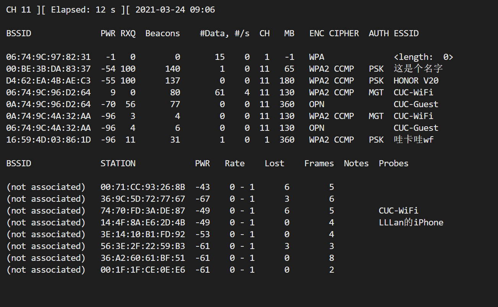

+ 使用`vscode`的`downlode`功能将上述抓取的数据包下载到本地。(也可以使用windows自带的`scp`命令),方便在主机上使用`wireshark`进行分析。

  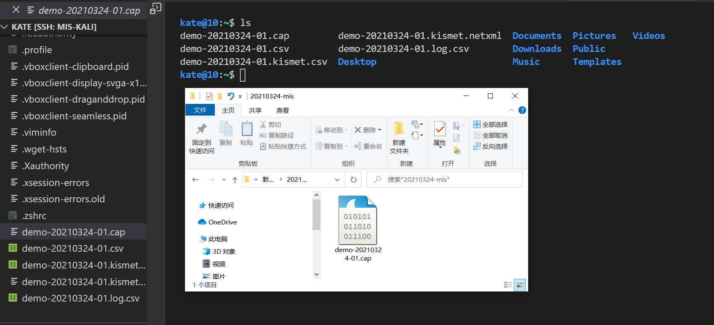

###  `OpenWrt`配置

+ 网络配置：通过 `vi` 直接编辑 `/etc/config/network` 配置文件来设置好远程管理专用网卡的 IP 地址。修改 `OpenWrt` 局域网地址为当前 Host-only 网段内可用地址，只需要修改 `option ipaddr` 的值即可。

  ```
  config interface 'lan'
      option type 'bridge'
      option ifname 'eth0'
      option proto 'static'
      option ipaddr '192.168.152.101' 
      option netmask '255.255.255.0'
      option ip6assign '60'
  ```

  然后可以通过重启系统使之重新加载配置。

+ 安装`LuCi`

  ```
  # 更新 opkg 本地缓存
  opkg update
  
  # 检索指定软件包
  opkg find luci
  # luci - git-19.223.33685-f929298-1
  
  # 查看 luci 依赖的软件包有哪些 
  opkg depends luci
  # luci depends on:
  #     libc
  #     uhttpd
  #     uhttpd-mod-ubus
  #     luci-mod-admin-full
  #     luci-theme-bootstrap
  #     luci-app-firewall
  #     luci-proto-ppp
  #     libiwinfo-lua
  #     luci-proto-ipv6
  
  # 查看系统中已安装软件包
  opkg list-installed
  
  # 安装 luci
  opkg install luci
  
  # 查看 luci-mod-admin-full 在系统上释放的文件有哪些
  opkg files luci-mod-admin-full
  # Package luci-mod-admin-full (git-16.018.33482-3201903-1) is installed on root and has the following files:
  # /usr/lib/lua/luci/view/admin_network/wifi_status.htm
  # /usr/lib/lua/luci/view/admin_system/packages.htm
  # /usr/lib/lua/luci/model/cbi/admin_status/processes.lua
  # /www/luci-static/resources/wireless.svg
  # /usr/lib/lua/luci/model/cbi/admin_system/system.
  # ...
  # /usr/lib/lua/luci/view/admin_network/iface_status.htm
  # /usr/lib/lua/luci/view/admin_uci/revert.htm
  # /usr/lib/lua/luci/model/cbi/admin_network/proto_ahcp.lua
  # /usr/lib/lua/luci/view/admin_uci/changelog.htm
  ```

+ 安装完`LuCi`后浏览器访问的结果

  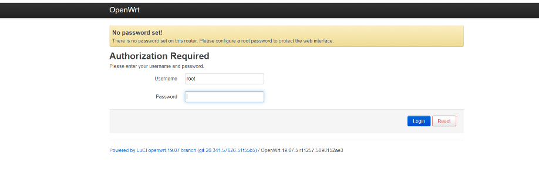

+ 检测网卡驱动

  ```
  root@OpenWrt:~# lsusb
  Bus 002 Device 001: ID 1d6b:0003 Linux Foundation 3.0 root hub
  Bus 001 Device 002: ID 0bda:8178 Realtek Semiconductor Corp. RTL8192CU 802.11n WLAN Adapter
  Bus 001 Device 001: ID 1d6b:0002 Linux Foundation 2.0 root hub
  root@OpenWrt:~# lsusb -t
  /:  Bus 02.Port 1: Dev 1, Class=root_hub, Driver=xhci_hcd/6p, 5000M
  /:  Bus 01.Port 1: Dev 1, Class=root_hub, Driver=xhci_hcd/8p, 480M
      |__ Port 1: Dev 2, If 0, Class=Vendor Specific Class, Driver=, 480M
  ```

  发现`RTL8192CU`无线网卡无驱动。

+ 安装驱动

  ```
  #快速查找可能包含指定芯片名称的驱动程序包
  root@OpenWrt:~# opkg find kmod-* | grep rtl8192cu
  kmod-rtl8192cu - 4.14.209+4.19.137-1-2 - Realtek RTL8192CU/RTL8188CU support
  #安装上述查询出的驱动
  opkg install kmod-rtl8192cu
  #安装完成后检查：
  root@OpenWrt:~# lsusb -t
  /:  Bus 02.Port 1: Dev 1, Class=root_hub, Driver=xhci_hcd/6p, 5000M
  /:  Bus 01.Port 1: Dev 1, Class=root_hub, Driver=xhci_hcd/8p, 480M
      |__ Port 1: Dev 2, If 0, Class=Vendor Specific Class, Driver=rtl8192cu, 480M   
  root@OpenWrt:~#
  ```

  安装驱动前：

  ​	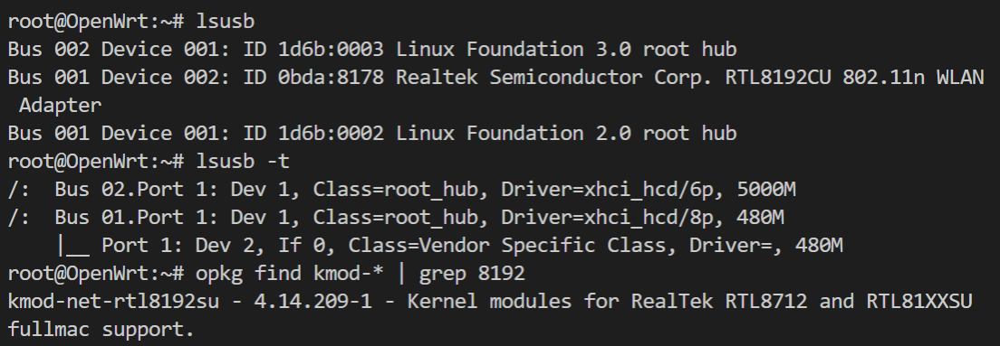

  ​	安装驱动后：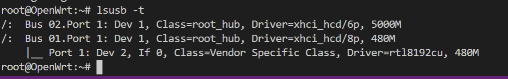

+ 安装`wpa-supplicant` 和 `hostapd`。

  ```
  #wpa-supplicant 和 hostapd 。其中 wpa-supplicant 提供 WPA 客户端认证，hostapd 提供 AP 或 ad-hoc 模式的 WPA 认证。
  opkg install hostapd wpa-supplicant
  ```

+ 重启系统，使得上述安装的配置生效。以便能够在`LuCi` 的网页版中管理无线网卡设置。能在网页版的`Network`下拉菜单中看见`Wireless`为上述操作成功的标识。

  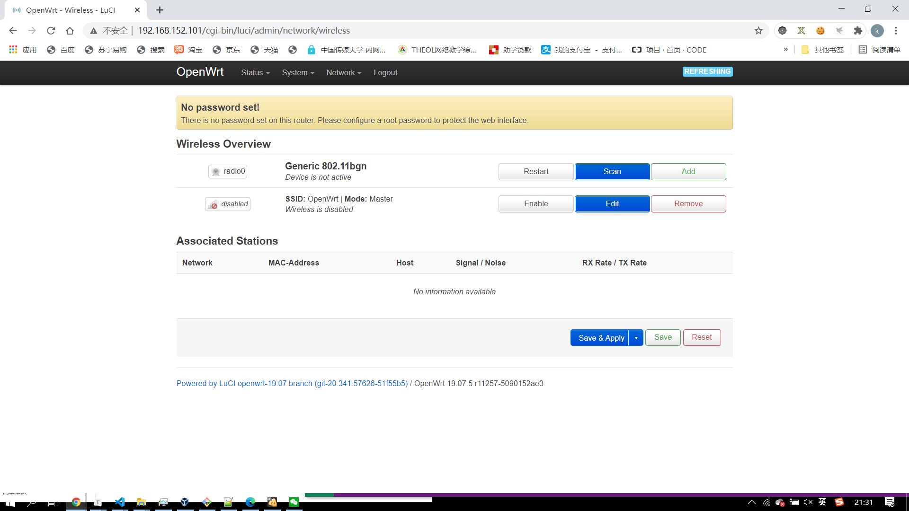

+ 进行下述的配置

  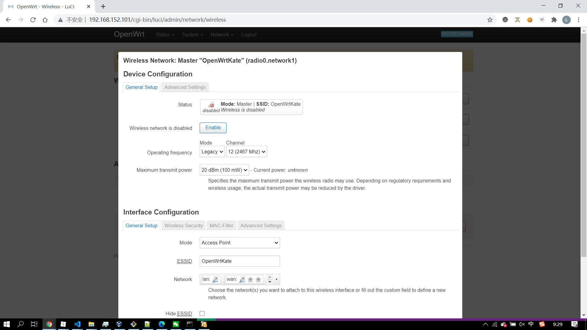

+ `Enable`

  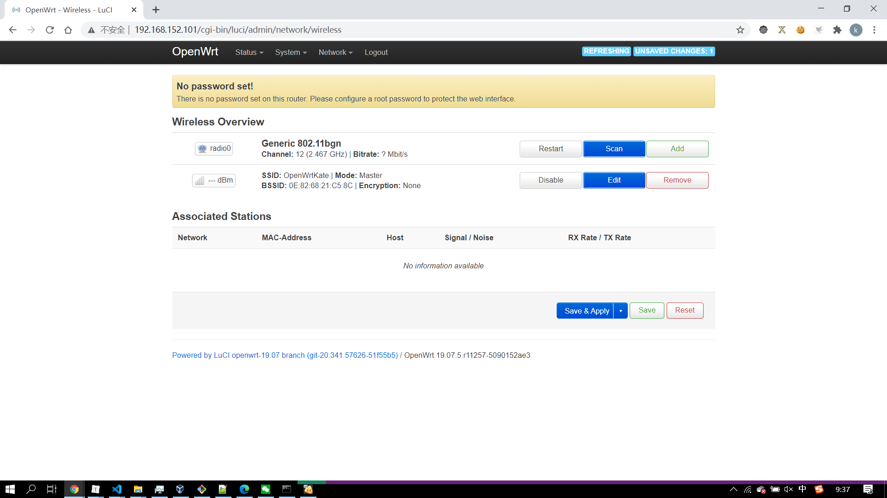

+ 手机连接之后

  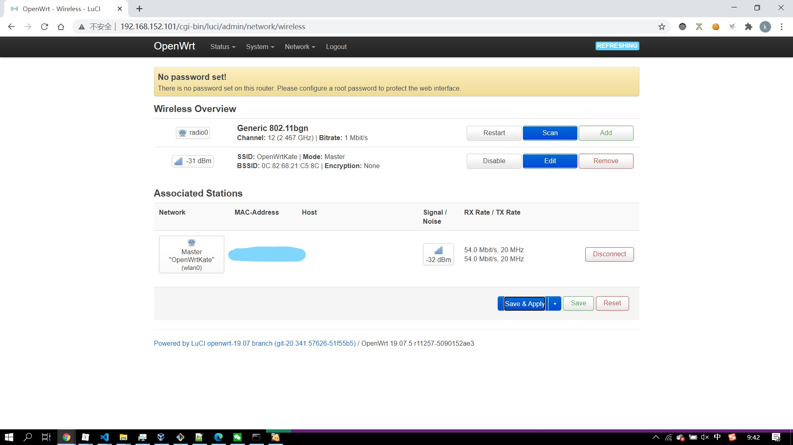


## 复习VirtualBox的配置与使用

+ 虚拟机镜像列表：

  

  虚拟介质管理：

  

+ 设置虚拟机和宿主机的文件共享，实现宿主机和虚拟机的双向文件共享

  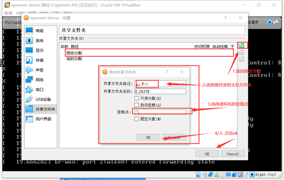

+ 虚拟机镜像备份和还原的方法

  + 备份：

  

  + 还原：备份镜像右键：恢复备份。

  

  

+ 熟悉虚拟机基本网络配置，了解不同联网模式的典型应用场景

  + `hostonly`为例：

    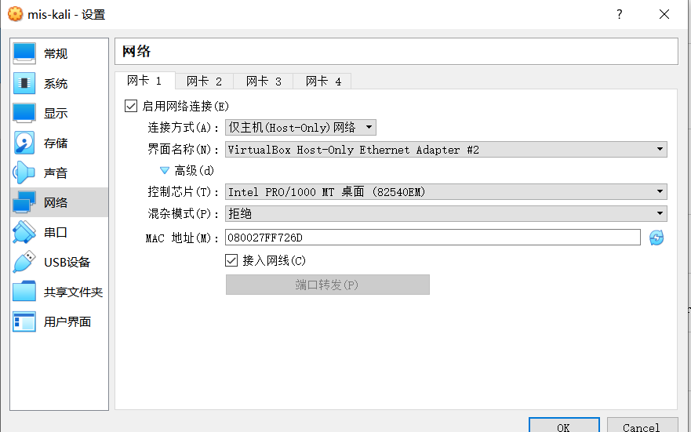

## `OpenWrt`使用

### 无线路由器/无线接入点（AP）配置

以下实验，默认配置的是AP，除非特别说明时会强调该实验内容需要无线路由器支持。

+ 重置和恢复AP到出厂默认设置状态

  重置`	OpenWrt`的配置，包括其公私钥、`ip`配置（`/etc/config/network`文件的内容）、root的密码(清空)，都会重置。

  

  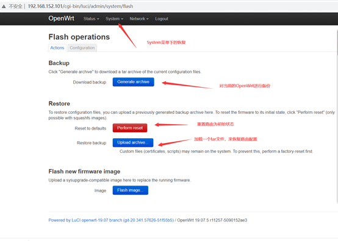

  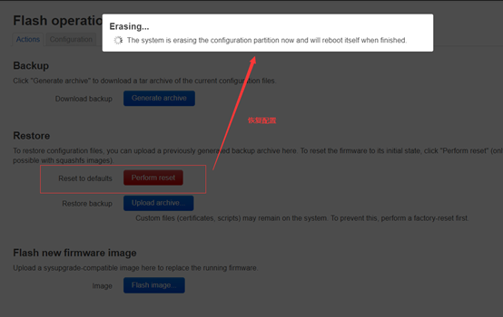

+ 设置AP的管理员用户名和密码

  只有修改密码的界面，如下：

  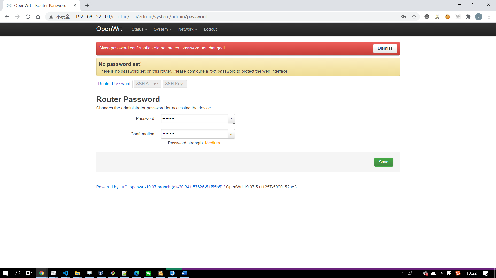

+ 设置SSID广播和非广播模式

  勾选详情配置中的`Hide ESSID`为非广播模式，不勾选为广播模式。

  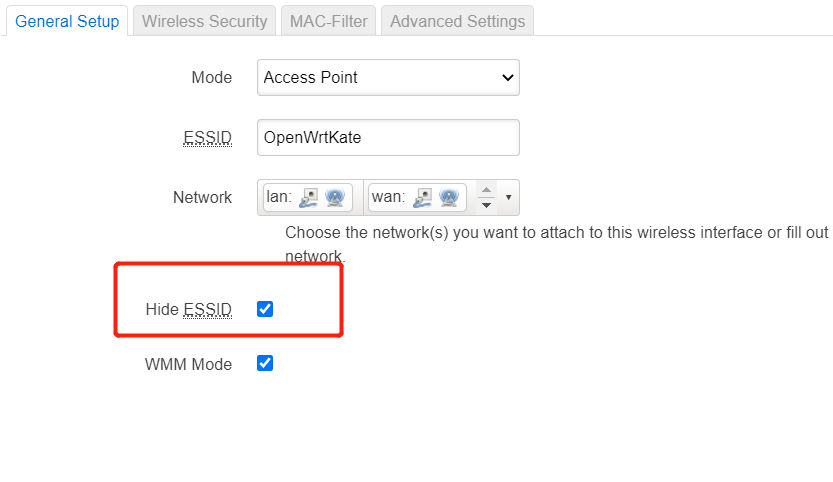

+ 配置不同的加密方式

  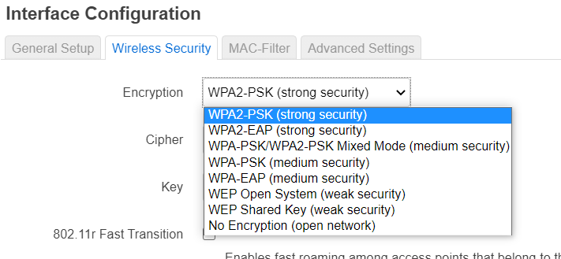

  例如：

  + `WEP Shared Auth (WEP-40)`

  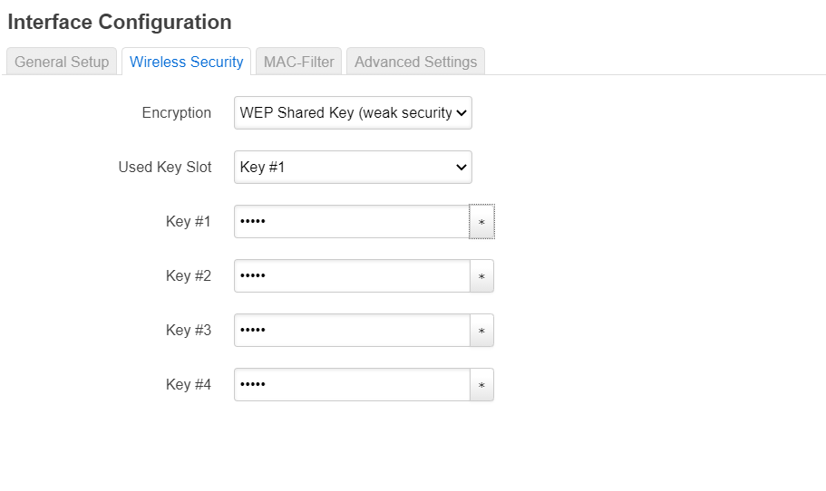

  + WPA2 PSK (CCMP)

    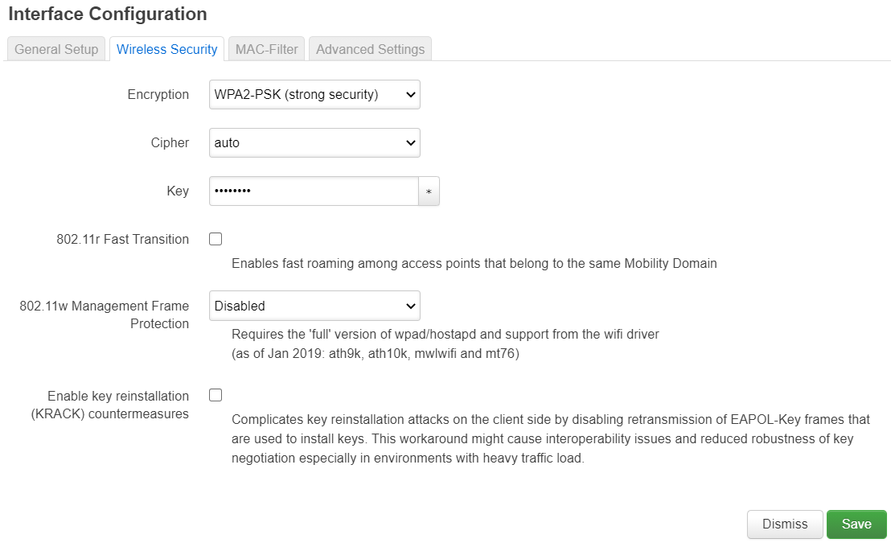

    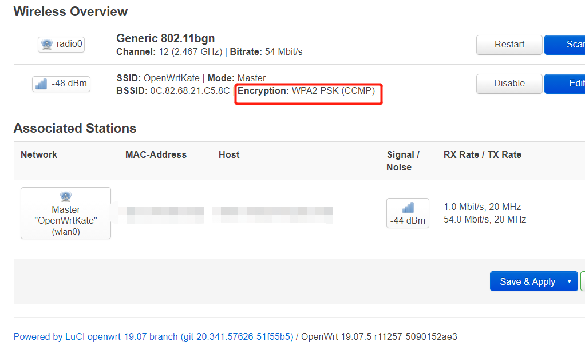

  + ……

+ 设置AP管理密码

  

+ 配置无线路由器使用自定义的DNS解析服务器

  

+ 配置DHCP和禁用DHCP

  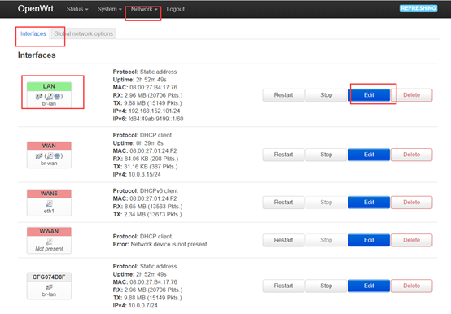

  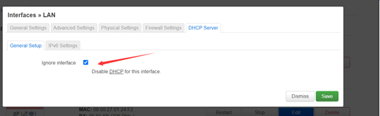

+ 开启路由器/AP的日志记录功能（对指定事件记录）

  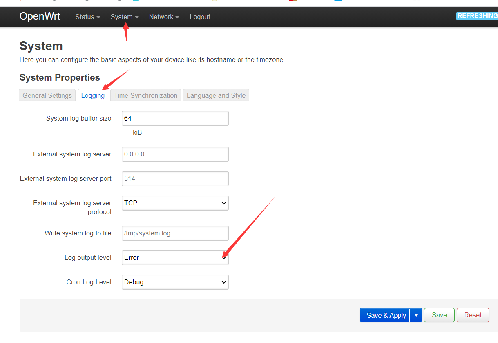

+ 配置AP隔离(WLAN划分)功能

  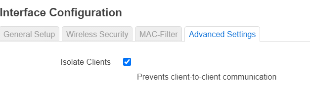

+ 设置MAC地址过滤规则（ACL地址过滤器）

  将客户端不加入`MAC listed only`。

  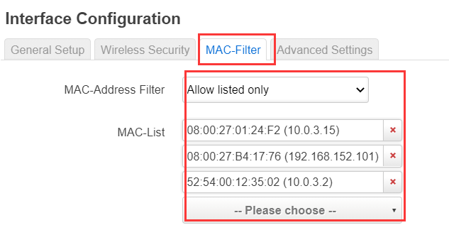

+ 查看WPS功能的支持情况

   `WPS` :  `wi-fi`保护设置。支持WPA-EAP、WPA-PSK、WPA-PSK/WPA-PSK Mixed Mode 、 WPA2-EAP、WPA2-PSK几种加密认证方式。

  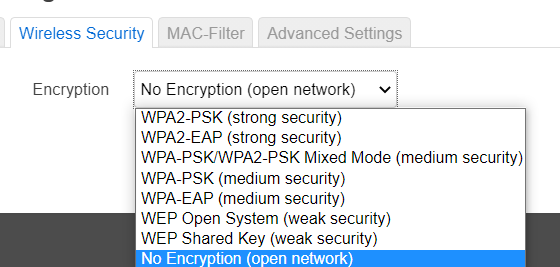

+ 查看AP/无线路由器支持哪些工作模式

  具有以下的工作模式：

  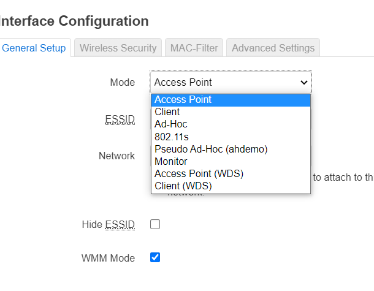

### 使用手机连接不同配置状态下的AP对比实验

+ 设置SSID广播和非广播模式

  非广播模式下手机看不到名为`OpenWrtKate`的热点。

  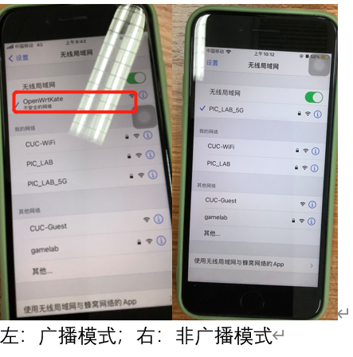

  

+ 配置不同的加密方式

  无密码时，可直接连接，当配置了加密时，客户端需要输入密码才可以加入热点。手机端可以查看当前所用的加密方式。并给出不安全、低安全性等不同的安全提醒。

  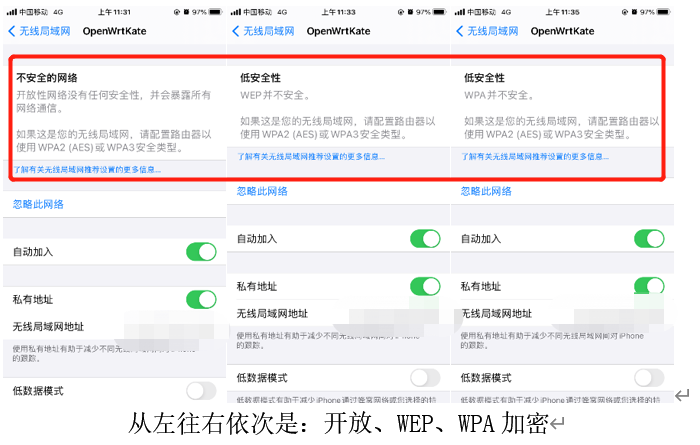

  

+ 配置DHCP和禁用DHCP

  对于`wan`网卡，手机端设置没有变化；对于`lan`网卡，手机端是否有`ip`取决于`OpenWrt`是否配置有DHCP。

  AP工作在`wan`口(Nat网卡)：`OpenWrt`NAT网卡的`ip`本质为`VirtualBox`所分配。`OpenWrt`充当AP接受到客户端(手机端)`DHCP`的请求之后，将`802.11`协议的数据转换为以太网协议，然后请求数据包被发往`wan`口 ==> 也就是`20.0.3.15`，也就是NAT网卡地址。接下来，数据包发给`gateway`：`VirtualBox`(10.0.3.2)，他在收到该DHCP请求后，给客户端分配一个`ip`(10.0.3.16)。因此，无论`OpenWrt`是否配置了DHCP服务器，只要AP接收到的数据发送到`wan`口，客户端均正常分配到`ip`。

  使AP工作在`lan`口(host-only网卡)，也就是将AP接受到的无线网络中数据包发送给`lan`口，也就是`192.168.152.101`(host-only网卡),此时，若是`OpenWrt`禁用DHCP，则客户端分配不到`ip`，但若是启用DHCP，则客户端可以分配到DHCP。

  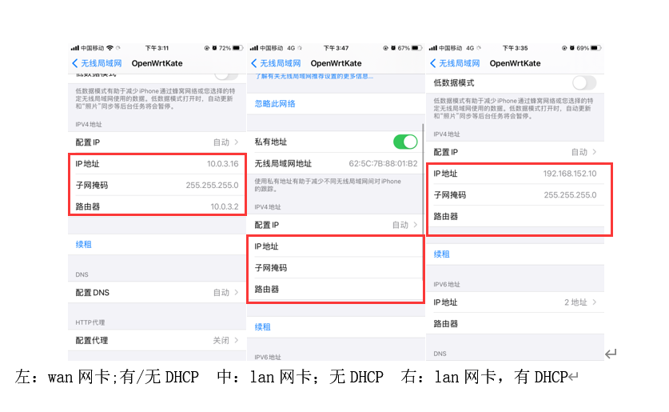

  只配置`lan`接口为AP工作网卡。并对其配置DHCP，客户端(其他电脑)连接后的`ip`分配情况。

  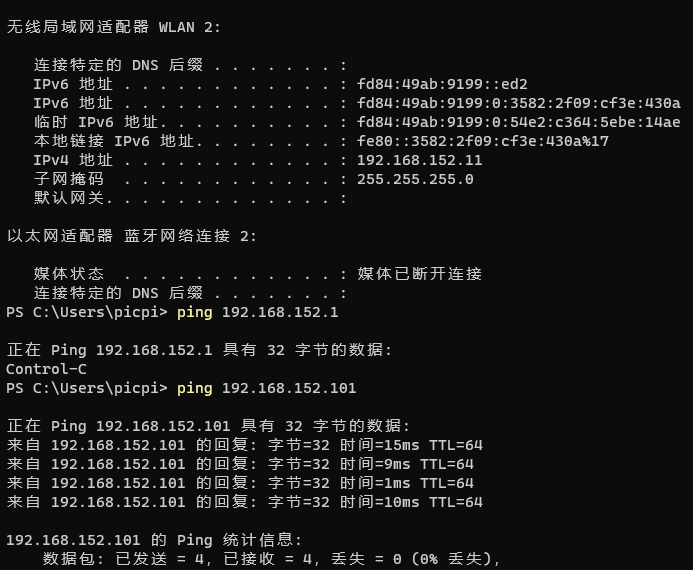

  

+ 设置MAC地址过滤规则（ACL地址过滤器）

  将客户端不加入`MAC listed only`，则客户端连接不到该热点。

  

  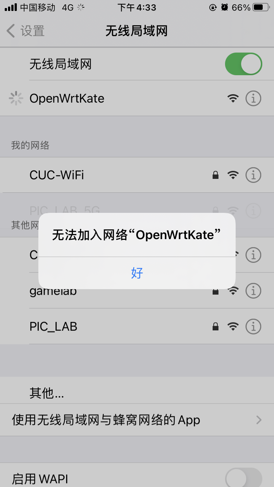

+ 如果手机无法分配到IP地址但又想联网该如何解决？

  手动指定`ip`、`dns`、`dhcp`、路由等？实验并没成功。

### 使用路由器/AP的配置导出备份功能，尝试解码导出的配置文件

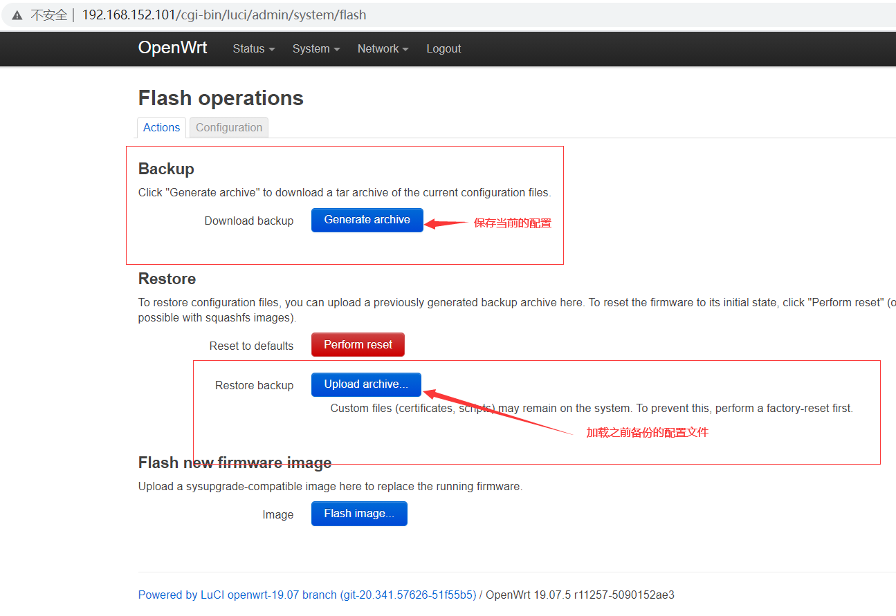

+ 导出文件为:[backup-OpenWrt-2021-03-26.tar.gz](./backup-OpenWrt-2021-03-26.tar.gz)，解压得到[etc文件夹](./etc)。

## 参考资料

[黄大课本](https://c4pr1c3.github.io/cuc-mis/chap0x01/exp.html)

