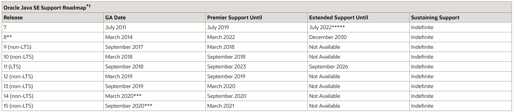
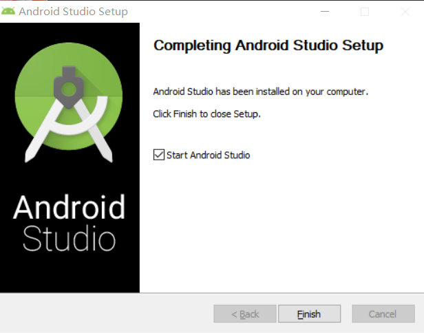
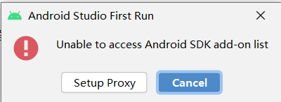
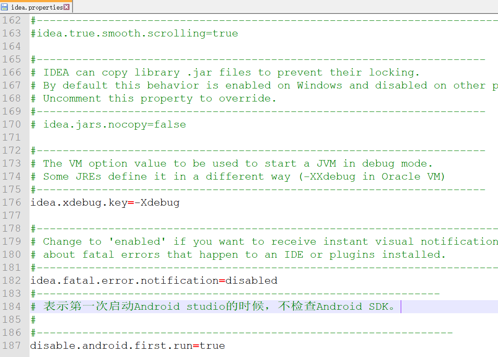
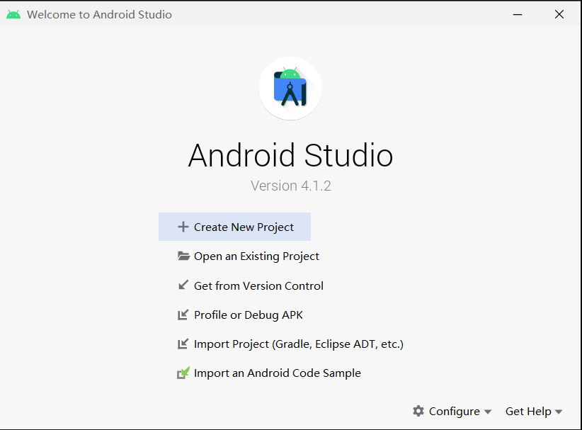
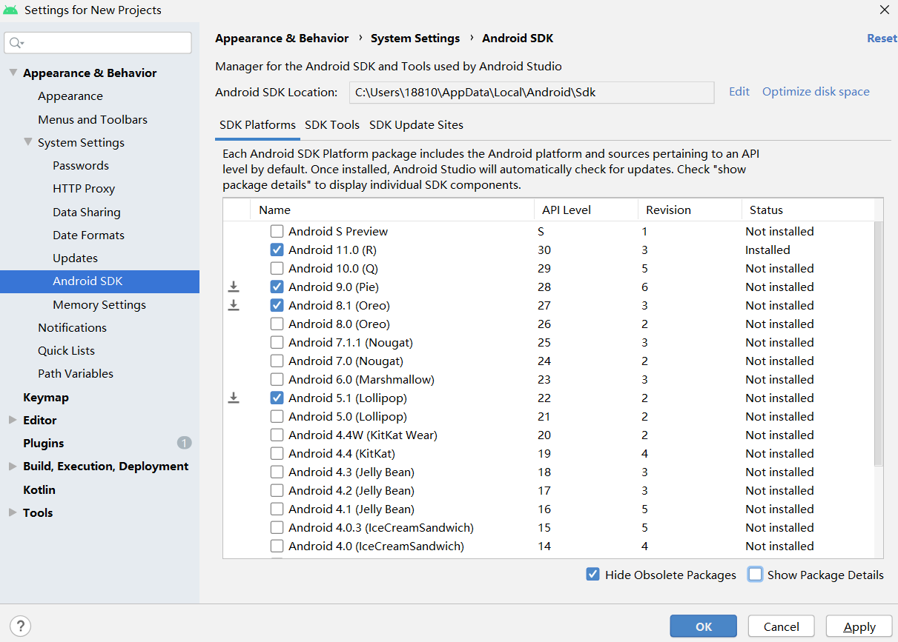
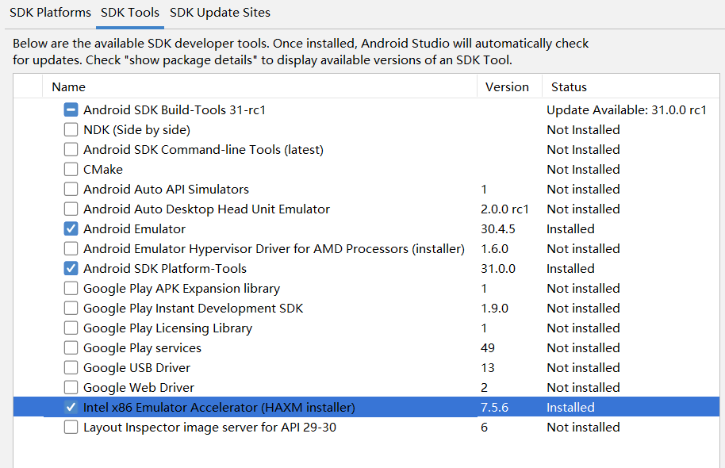
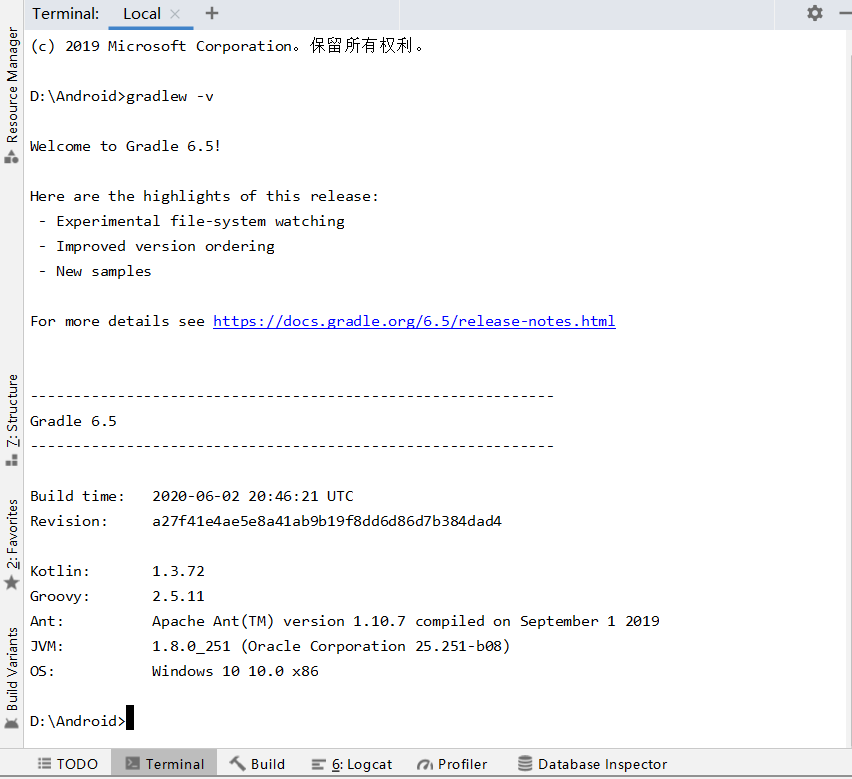

# 第五章  模拟器环境搭建笔记

## 安装和配置 Java SDK

+ what is Java SDK?

  >`SDK`是`Software Development Kit`的缩写，即：软件开发工具包。一个完整的`SDK`包括：
  >
  >（1）接口文件和库文件；
  >
  >（2）帮助文档；
  >
  >（3）开发示例；
  >
  >（4）实用工具。

  java SDK 就是包含java基础类库和java开发工具的文件集合，构成一个java的开发平台。

+ How to chose java SDK version?

  从 [Oracle Java SE Support Roadmap](https://www.oracle.com/technetwork/java/javase/eol-135779.html)给出的信息可知，java 11是长期支持版本(LTS)。

  

+ what happened to java SDK according to [Oracle](https://blogs.oracle.com/java-platform-group/oracle-jdk-releases-for-java-11-and-later) ?

  Oracle 将在 GPLv2 许可证下提供 JDK 版本，采用 Classpath Exception (GPLv2+CPE) 的方式。即：只是使用java里面的各个模块，不受GPL的影响，依旧可以闭源发布内容。但是如果改变了java 里的modle，就必须开源。

  > what is GPL?
  >
  > GPL即：General Public License，公共许可协议，力图保障分享和修改自由软件的权利——确保自由软件对其用户来说是自由的。
  >
  > 使用该协议的软件发布之后，任何人可以复制、分发、修改软件。如果基于本程序做了修改，并对修改申请了专利，就需要把这个专利让所有人免费使用，要么就不要发布。

## 安装Android Studio

国外官网下载总是出现网络问题，用google为国内提供的网站[https://developer.android.google.cn/studio](https://developer.android.google.cn/studio#downloads)下载较快。

+ 按步骤安装即可。

+ Android Studio首次启动，在默认路径下未找到`Android SDK`就会报下述错误。

  
  + 解决办法：**跳过检测**
    		在Android Studio的安装目录下，找到`\bin\idea.properties`
      		在尾行添加`disable.android.first.run=true`，表示初次启动不检测SDK

    

  + success:

    

    

## 下载安装 Android SDK

在`SDK manager`里面 的SDK Platforms 选项卡可以选择不同版本的 SDK 下载安装（磁盘空间有限，目前只安装了Android 11.0版本）：

## 配置 Android 模拟器运行环境

在 PC / Mac 上运行 Android 模拟器强烈建议必须安装 Intel x86 Emulator Accelerator (HAXM installer)，并且配合使用 ABI 类型为 x86/x86_64 的模拟器以获得最流畅的模拟器使用体验。

## 配置 Gradle 编译环境

在terminal里面输入`gradlew -v`, 由下图可知，该环境已经配置了`Gradle 6.5`。

#  参考文献

+ [黄玮老师第五章实验指南](https://c4pr1c3.github.io/cuc-mis/chap0x05/exp.html)

