## 实验环境

+ `Android Studio`[环境配置详见第五章报告]([2021-mis-public-kate123wong/chap0x05 at chap0x05 · CUCCS/2021-mis-public-kate123wong (github.com)](https://github.com/CUCCS/2021-mis-public-kate123wong/tree/chap0x05/chap0x05))

## 实验目的

+ 熟悉`Andriod  Studio`模拟器开发安卓的应用程序的环境和基本流程，并能实现简单的应用程序的开发。
+ 了解使用`ABD`在命令行中对模拟设备进行基本的操作。
+ 为后续的程序逆向和组件安全实验做一些“标靶”。

## 实验内容

###  ADB实验

#### 使用`adb shell`连接模拟器

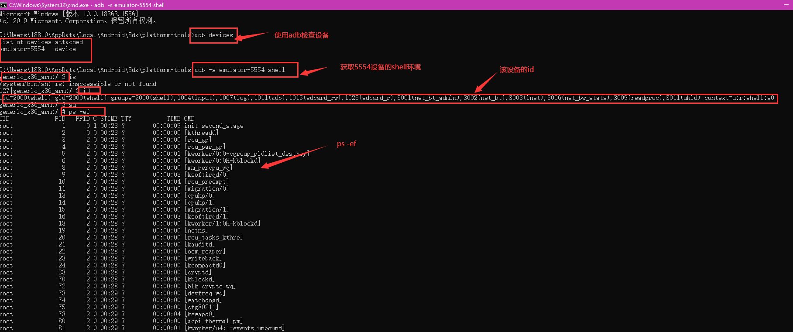

#### `echo $PATH`命令

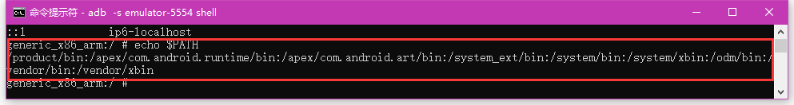

#### `uname -a`命令

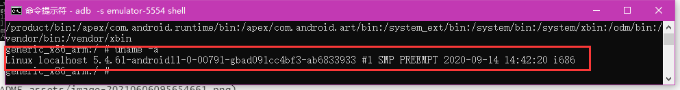


#### `adb push`命令

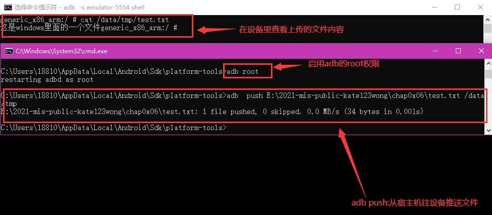

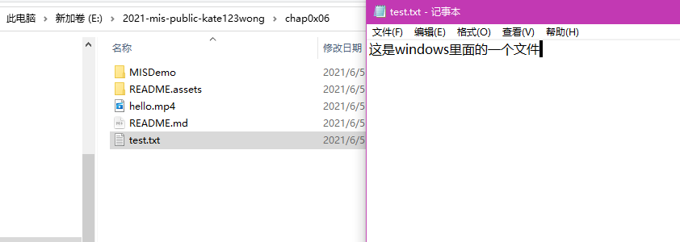

#### `adb pull`命令

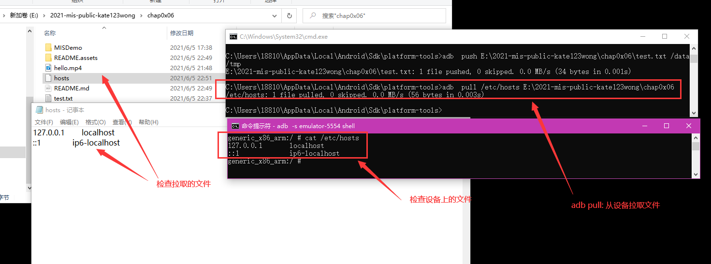

#### `adb install`命令

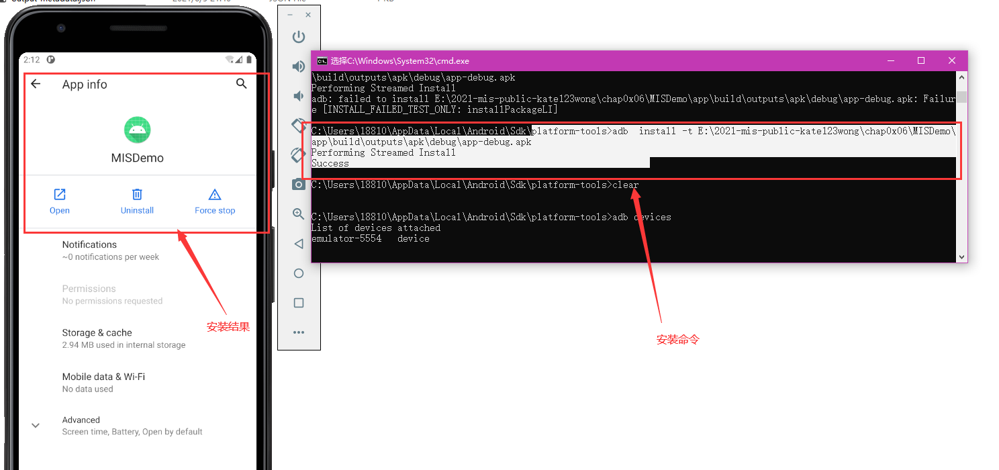

[安装效果视频](README.assets/adb_install演示.mp4)


### Hello World v1

按照[创建 Android 项目](https://developer.android.com/training/basics/firstapp/creating-project)进行项目创建。(官网的操作步骤非常详细了，这里不再赘述，现将基本的操作过程视图展现如下)

#### 创建空项目

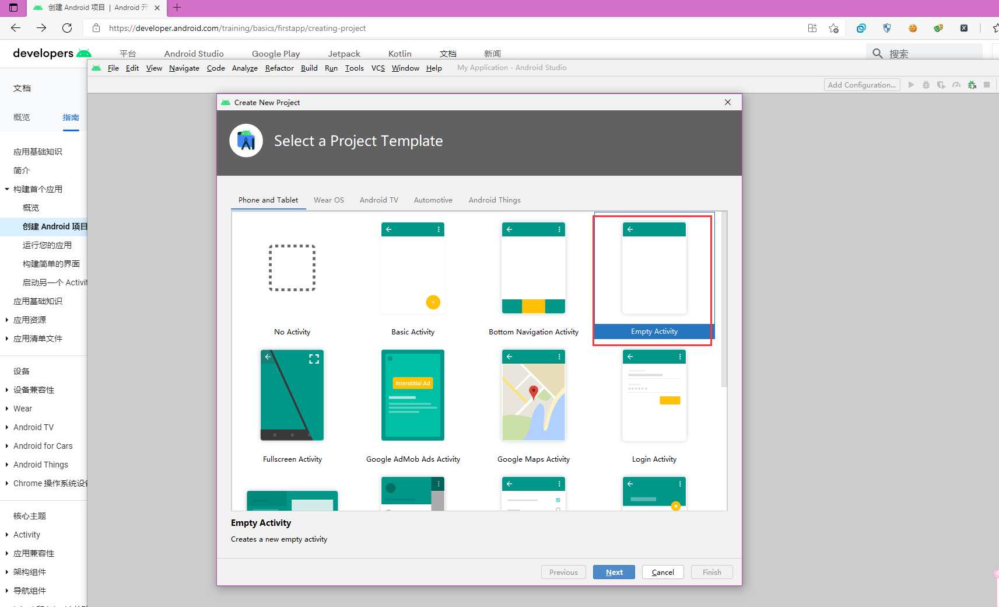

#### 进行基础设置

+ Name：`MISDemo`;
+ Package name: `cuc.edu.cn`;
+ Save location: `E:\2021-mis-public-kate123wong\chap0x06\MISDemo`;
+ Language: `Java`.

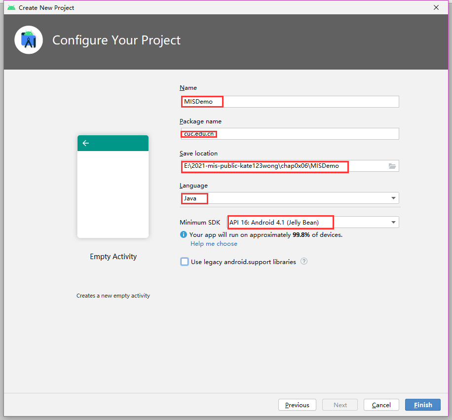

#### 启动设备模拟器

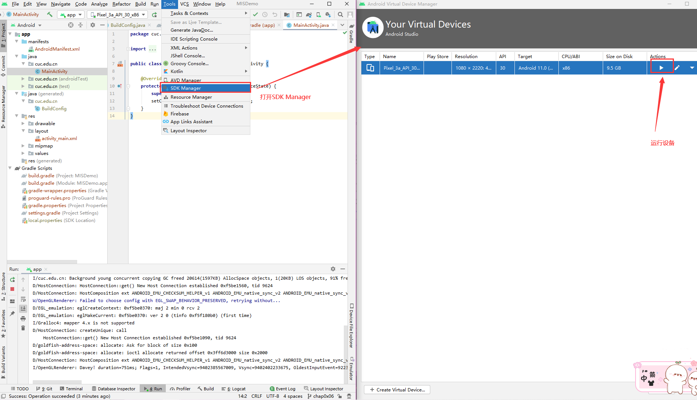

#### `build`项目&启动模拟设备

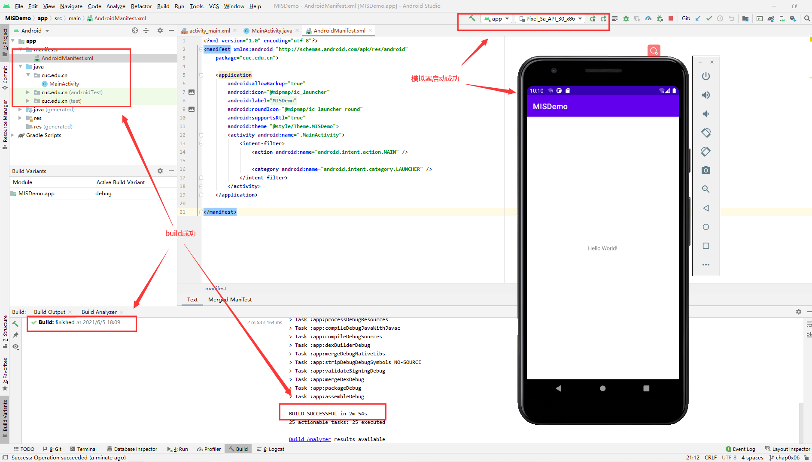

#### 页面`MainActivity`的实验效果

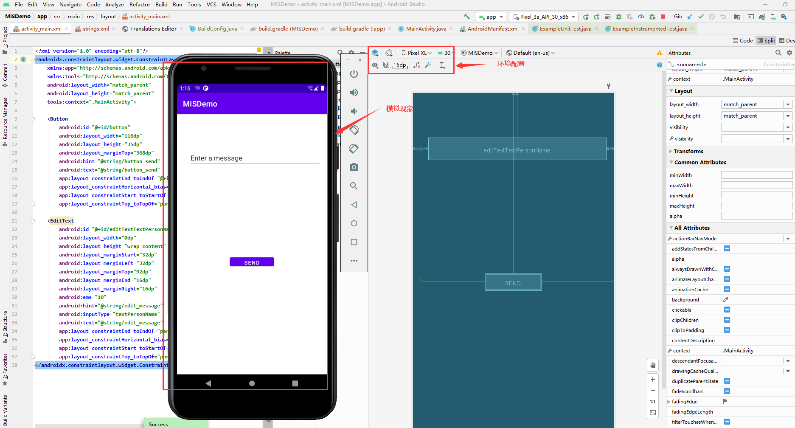

#### 最终实验效果

[演示视频连接](README.assets/hello.mp4)

#### Question

在代码编写和运行过程中，请特别关注以下问题：

+ [x] 按照向导创建的工程在模拟器里运行成功的前提下，生成的APK文件在哪儿保存的？

  >`E:\2021-mis-public-kate123wong\chap0x06\MISDemo\app\build\outputs\apk\debug\app-debug.apk`

+ [x] 使用adb shell是否可以绕过MainActivity页面直接“唤起”第二个DisplayMessageActivity页面？是否可以在直接唤起的这个DisplayMessageActivity页面上显示自定义的一段文字，比如：你好移动互联网安全

  > 可以使用adb shell绕过MainActivity页面直接“唤起”第二个DisplayMessageActivity页面。使用`adb shell am start -n package/launch activity`便可以直接启动相应的页面。在此例中，`package`是`cuc.edu.cn`，`launch activity`是`.DisplayMessageActivity`,所以绕过MainActivity页面直接“唤起”第二个DisplayMessageActivity页面的命令是`adb shell am start -n cuc.edu.cn/.DisplayMessageActivity `[[实验现象]](README.assets/adb_shell直接启用Display页面.mp4);

  >可以在直接唤起的这个DisplayMessageActivity页面上显示自定义的一段文字。过程如下：
  >
  >+ 将`DisplayMessageActivity`文件中的`message`改为：`intent.getStringExtra("hello");`。如下：
  >
  >  ```java
  >  public class DisplayMessageActivity extends AppCompatActivity {
  >  
  >      @Override
  >      protected void onCreate(Bundle savedInstanceState) {
  >          super.onCreate(savedInstanceState);
  >          setContentView(R.layout.activity_display_message); // 进行页面布局
  >  
  >          // Get the Intent that started this activity and extract the string
  >          Intent intent = getIntent();
  >          //String message = intent.getStringExtra(MainActivity.EXTRA_MESSAGE);
  >          String message = intent.getStringExtra("hello");
  >          // Capture the layout's TextView and set the string as its text
  >          TextView textView = findViewById(R.id.textView);
  >          textView.setText(message);
  >      }
  >  }
  >  ```
  >
  >+ 然后重新启动模拟设备；
  >+ 使用命令`adb shell am start -n cuc.edu.cn/.DisplayMessageActivity -e hello  你好移动互联网安全 `即可实现要求
  >  + 原理为：通过`-e`参数指定传给`DisplayMessageActivity `页面的参数。键为`hello`，值为`你好移动互联网安全`。在页面中，使用 `getIntent().getStringExtra("hello");即可得到所传递的参数的值。
  >
  >+ [实验结果](README.assets/adb_shell传参.mp4)

+ [x] 如何实现在真机上运行你开发的这个Hello World程序？

  >使用`WiFi`或者`USB`数据线让PC与安卓手机相连。此处选择USB数据线。
  >
  >然后在`Android Studio`中选择对应的手机，并在手机上运行程序即可。
  >
  >[实验结果](README.assets/真机演示.mp4)

+ [ ]  如何修改代码实现通过 `adb shell am start -a android.intent.action.VIEW -d http://sec.cuc.edu.cn/` 可以让我们的cuc.edu.cn.misdemo程序出现在“用于打开浏览器的应用程序选择列表”？

  

+ [x]  如何修改应用程序默认图标？

  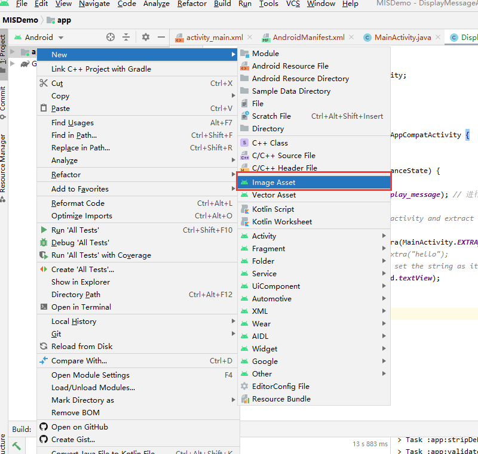

  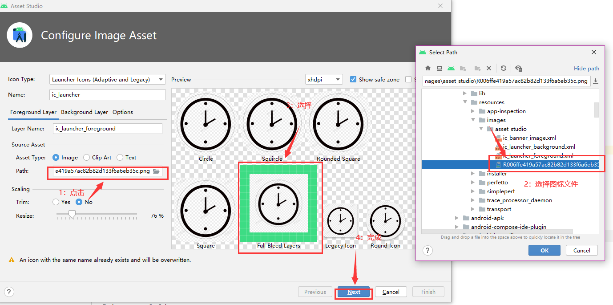

  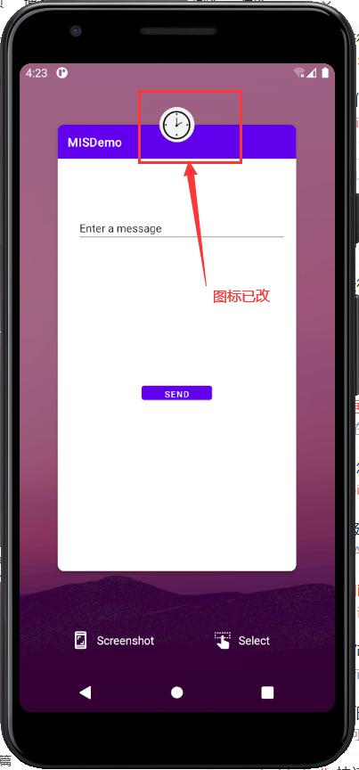

+ [ ]  如何修改代码使得应用程序图标在手机主屏幕上实现隐藏？

  

### Hello World v2


## 实验问题

+ 无

## 参考文献

+ [黄大课件](https://c4pr1c3.github.io/cuc-mis/chap0x06/exp.html#activity-manager-am)
+ [教学视频](https://www.bilibili.com/video/BV1rr4y1A7nz?p=125&spm_id_from=pageDriver)