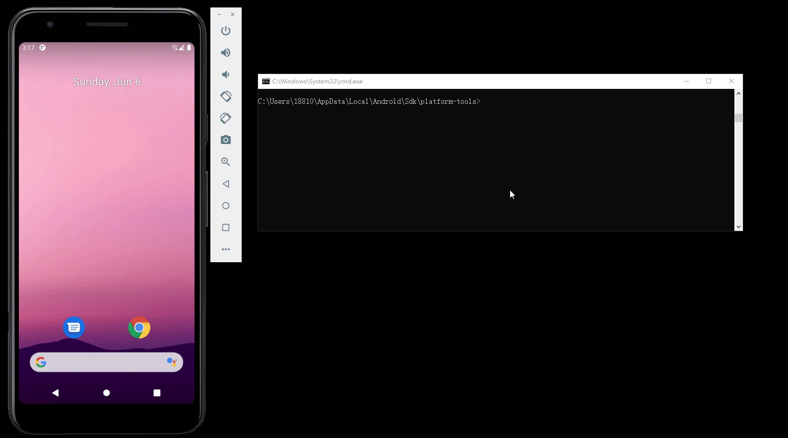

## 实验环境

+ `Android Studio`[环境配置详见第五章报告](https://github.com/CUCCS/2021-mis-public-kate123wong/tree/chap0x05/chap0x05)

## 实验目的

+ 熟悉`Andriod  Studio`模拟器开发安卓的应用程序的环境和基本流程，并能实现简单的应用程序的开发。
+ 了解使用`ABD`在命令行中对模拟设备进行基本的操作。
+ 为后续的程序逆向和组件安全实验做一些“标靶”。

## 实验内容

###  ADB实验

#### 使用`adb shell`连接模拟器


#### `echo $PATH`命令


#### `uname -a`命令


#### `adb push`命令


#### `adb pull`命令


#### `adb install`命令


#### `am`实例

```bash
# Camera（照相机）的启动方法为:
am start -n com.android.camera/com.android.camera.Camera

Browser（浏览器）的启动方法为：
am start -n com.android.browser/com.android.browser.BrowserActivity

# 启动浏览器 :
am start -a android.intent.action.VIEW -d  http://sec.cuc.edu.cn/

# 拨打电话 :
am start -a android.intent.action.CALL -d tel:10086

# 发短信：
adb shell am start -a android.intent.action.SENDTO -d sms:10086 --es sms_body ye --ez exit_on_sent true
```


```bash
adb shell pm uninstall com.example.MyApp
```


```bash
# 常用的按键对应的KEY_CODE
adb shell input keyevent 22 //焦点去到发送键
adb shell input keyevent 66 //回车按下

adb shell input keyevent 4 // 物理返回键
adb shell input keyevent 3 // 物理HOME键

# android 4.0+
$ input
usage: input ...
       input text <string>
       input keyevent <key code number or name>
       input tap <x> <y>
       input swipe <x1> <y1> <x2> <y2>
```


### Hello World v1

按照[创建 Android 项目](https://developer.android.com/training/basics/firstapp/creating-project)进行项目创建。(官网的操作步骤非常详细了，这里不再赘述，现将基本的操作过程视图展现如下)

#### 创建空项目


#### 进行基础设置

+ Name：`MISDemo`;
+ Package name: `cuc.edu.cn`;
+ Save location: `E:\2021-mis-public-kate123wong\chap0x06\MISDemo`;
+ Language: `Java`.


#### 启动设备模拟器


#### `build`项目&启动模拟设备


#### 页面`MainActivity`的实验效果


#### 最终实验效果


#### Question

在代码编写和运行过程中，请特别关注以下问题：

+ [x] 按照向导创建的工程在模拟器里运行成功的前提下，生成的APK文件在哪儿保存的？

  >`E:\2021-mis-public-kate123wong\chap0x06\MISDemo\app\build\outputs\apk\debug\app-debug.apk`

+ [x] 使用adb shell是否可以绕过MainActivity页面直接“唤起”第二个DisplayMessageActivity页面？是否可以在直接唤起的这个DisplayMessageActivity页面上显示自定义的一段文字，比如：你好移动互联网安全

  > 可以使用adb shell绕过MainActivity页面直接“唤起”第二个DisplayMessageActivity页面。使用`adb shell am start -n package/launch activity`便可以直接启动相应的页面。在此例中，`package`是`cuc.edu.cn`，`launch activity`是`.DisplayMessageActivity`,所以绕过MainActivity页面直接“唤起”第二个DisplayMessageActivity页面的命令是`adb shell am start -n cuc.edu.cn/.DisplayMessageActivity `
  >
  > ;

  >可以在直接唤起的这个DisplayMessageActivity页面上显示自定义的一段文字。过程如下：
  >
  >+ 将`DisplayMessageActivity`文件中的`message`改为：`intent.getStringExtra("hello");`。如下：
  >
  >  ```java
  >  public class DisplayMessageActivity extends AppCompatActivity {
  >  
  >      @Override
  >      protected void onCreate(Bundle savedInstanceState) {
  >          super.onCreate(savedInstanceState);
  >          setContentView(R.layout.activity_display_message); // 进行页面布局
  >  
  >          // Get the Intent that started this activity and extract the string
  >          Intent intent = getIntent();
  >          //String message = intent.getStringExtra(MainActivity.EXTRA_MESSAGE);
  >          String message = intent.getStringExtra("hello");
  >          // Capture the layout's TextView and set the string as its text
  >          TextView textView = findViewById(R.id.textView);
  >          textView.setText(message);
  >      }
  >  }
  >  ```
  >
  >+ 然后重新启动模拟设备；
  >+ 使用命令`adb shell am start -n cuc.edu.cn/.DisplayMessageActivity -e hello  你好移动互联网安全 `即可实现要求
  >  + 原理为：通过`-e`参数指定传给`DisplayMessageActivity `页面的参数。键为`hello`，值为`你好移动互联网安全`。在页面中，使用 `getIntent().getStringExtra("hello");`即可得到所传递的参数的值。
  >
  >+ 

+ [x] 如何实现在真机上运行你开发的这个Hello World程序？

  >使用`WiFi`或者`USB`数据线让PC与安卓手机相连。此处选择USB数据线。
  >
  >然后在`Android Studio`中选择对应的手机，并在手机上运行程序即可。
  >
  >

+ [x] 如何修改代码实现通过 `adb shell am start -a android.intent.action.VIEW -d http://sec.cuc.edu.cn/` 可以让我们的`cuc.edu.cn.misdemo`程序出现在“用于打开浏览器的应用程序选择列表”？

  > 在`AndroidManifest,xml`配置文件中的`.MainActivity`模块下添加：
  >
  > ```java
  >   <intent-filter>
  >        <action android:name="android.intent.action.MAIN" />
  >        <category android:name="android.intent.category.LAUNCHER" />
  >        <action android:name="android.intent.action.VIEW" />
  >        <category android:name="android.intent.category.DEFAULT" />
  >        <category android:name="android.intent.category.BROWSABLE" />
  >        <data android:scheme="http" />
  >        <data android:scheme="https" />
  >   </intent-filter>
  > ```

+ [x]  如何修改应用程序默认图标？

  > 
  >
  >  
  >
  >  

  

+ [x]  如何修改代码使得应用程序图标在手机主屏幕上实现隐藏？

  该方法使得程序运行之后
  
  ```java
  修改<category android:name="android.intent.category.LAUNCHER" />为：
      <category android:name="android.intent.category.LEANBACK_LAUNCHER"/>
  ```
  
  

### Hello World v2

- [x] 在v1基础之上，我们增加以下新功能来为后续的程序逆向和组件安全实验做一些“标靶”
  - [x] 使用SharedPreferences持久化存储小数据并按需读取
  - [x] 实现一个简单的注册码校验功能

#### 代码解读

`MainActivity`:

```java
public class MainActivity extends AppCompatActivity {
    public final static String EXTRA_MESSAGE = "cn.edu.cuc.mishello.MESSAGE";
    public SharedPreferences sharedPreferences;
    //通过使用SharePreferences API来保存简单的键值对数据。
    //可以通过以下两种方法来获取：
    // getSharedPreferences()  该方法需要提供一个共享参数文件的名称标识，该方法可以在任意Context中调用
    // getPreferences()  使用该方法主要是为一个activity的私有数据存储使用，该方法不提供文件的名称。

    @Override
    protected void onCreate(Bundle savedInstanceState) {
        super.onCreate(savedInstanceState);
        setContentView(R.layout.activity_main);

        // Load Saved to editText
        sharedPreferences = getSharedPreferences(getString(R.string.pref_filename), Context.MODE_PRIVATE);// 得到共享参数文件中的数据

        String saved_message = sharedPreferences.getString(getString(R.string.pref_usr_input_msg), ""); // 从共享参数文件中读取pref_usr_input_msg对应的值
        EditText editText = (EditText) findViewById(R.id.edit_message); //找到页面中id为edit_message的EditText：命名为editText
        editText.setText(saved_message);	//设置editText的Text值为为上文通过共享参数文件获取到的saved_message，即：上一次的用户输入的值
    }

    /** Called when the user clicks the Send button */
    public void sendMessage(View view) {
        // Prepare SharedPreferences
        sharedPreferences = getSharedPreferences(getString(R.string.pref_filename), Context.MODE_PRIVATE); //得到onCreate函数中使用的贡献参数文件
        SharedPreferences.Editor editor = sharedPreferences.edit(); //得到共享参数文件的edit句柄，便于修改用户输入的值

        // Do something in response to button
        Intent intent = new Intent(this, DisplayMessageActivity.class); // new一个Intent，用于当前页面和DisplayMessageActivity页面的传参
        EditText editText = (EditText) findViewById(R.id.edit_message); // 得到用户输入的editText
        String message = editText.getText().toString(); // 得到用户输入的message
        intent.putExtra(EXTRA_MESSAGE, message); // 将用户输入的message加入到Intent，便于将用户输入的内容传递到新的页面中去

        // Save Data
        editor.putString(getString(R.string.pref_usr_input_msg), message); // 将当前用户输入的内容存储到共享参数文件中，并覆盖之前用户输入的内容
        editor.commit(); // 提交对共享参数文件的修改

        startActivity(intent); // 启动页面跳转&页面传参
    }

}
```

`DisplayMessageActivity`:

```java
public class DisplayMessageActivity extends AppCompatActivity {

    private String SECRET_SEED = "sec.cuc.edu.cn";
    // 一个用于生成md5的种子

    @Override
    protected void onCreate(Bundle savedInstanceState) {
        super.onCreate(savedInstanceState);
        setContentView(R.layout.activity_display_message);

        register();
        //调用注册函数
    }

    private void register() {
        Intent intent = getIntent(); // 得到Intent，即MainActivity页面传来的参数
        String message = intent.getStringExtra(MainActivity.EXTRA_MESSAGE); // 得到MainActivity页面的EXTRA_MESSAGE值
        String secret_key = md5(SECRET_SEED).substring(0, 4); // 调用md5函数，生成secret_key

        Log.d("user input", message); // 打印message和secrt_key
        Log.d("debug secret_key", secret_key);

        TextView textView = new TextView(this);   // 新建一个View，用于显示是否注册成功
        textView.setTextSize(40); // 指定新建View中的字体大小

        if(message.equalsIgnoreCase(secret_key)) {
            //equalsIgnoreCase字符串相等则返回true；否则返回false
            textView.setText(getString(R.string.register_ok)); // 设置要显示的值为R.string.register_ok：该值在string.xml文件中定义为：注册成功
        } else {
            textView.setText(getString(R.string.register_failed)); // 同上，将会显示：注册失败
        }

        ViewGroup layout = (ViewGroup) findViewById(R.id.activity_display_message); // 需先手动将activity_display_message.xml中的该页面布局的id设为activity_display_message
        // 然后通过上述命令找到activity_display_message布局
        layout.addView(textView); // 向该页面布局中添加上述新建的textView:也就是显示注册成功或者失败
    }

    private String md5(String s) {
        try {
            // Create MD5 Hash
            MessageDigest digest =MessageDigest.getInstance("MD5");
            digest.update(s.getBytes());
            byte messageDigest[] = digest.digest();

            // Create Hex String
            StringBuffer hexString = new StringBuffer();
            for (int i=0; i<messageDigest.length; i++)
                hexString.append(Integer.toHexString(0xFF & messageDigest[i]));
            return hexString.toString();

        } catch (NoSuchAlgorithmException e) {
            e.printStackTrace();
        }
        return "";
    }
}
```

上述代码所需的string值在string.xml中定义：


#### xml页面布局

`MainActivity`的页面布局：


`DisplayMessageActivity`文件页面布局：

该页面中最后显示的View由代码生成，所以xml布局文件中并没有肉眼可见的View。但是注意整个页面布局的id必须设置为：`activitu_display_message`，因为代码中用到该id为其添加View。


#### 实验效果

注意：页面刚打开时显示的输入是用户的上次输入。


#### Question

- [x] DisplayMessageActivity.java中的2行打印日志语句是否有风险？如果有风险，请给出漏洞利用示范。如果没有风险，请给出理由。

>有风险。即使黑客不知道服务器发给用户的注册码，但是如果他获得了服务器的LOG日志读的权限，就能够知道`secret_key`，然后就可以根据该验证码在用户不知情的情况下进行成功注册。
>
>
>
> 

- [x] `SharedPreferences`类在进行读写操作时设置的`Context.MODE_PRIVATE`参数有何作用和意义？还有其他可选参数取值吗？

>`Context.MODE_PRIVATE`:为默认操作模式，代表该文件是私有数据，只能被应用本身访问，在该模式下，写入的内容会覆盖原文件的内容，如果想把新写入的内容追加到原文件中。
>
>`Context.MODE_APPEND`：模式会检查文件是否存在，存在就往文件追加内容，否则就创建新文件。
>
>`MODE_WORLD_READABLE`：表示当前文件可以被其他应用读取；
>
>`MODE_WORLD_WRITEABLE`：表示当前文件可以被其他应用写入。

## 实验问题

+ 运行时报如下错:

  

  解决方法：`adb uninstall cuc.edu.cn`，再次运行即可。

  

## 参考文献

+ [黄大课件](https://c4pr1c3.github.io/cuc-mis/chap0x06/exp.html#activity-manager-am)
+ [教学视频](https://www.bilibili.com/video/BV1rr4y1A7nz?p=125&spm_id_from=pageDriver)
+ [Android 数据存储之SharedPreferences详细总结](https://www.cnblogs.com/nucdy/p/5094297.html)

