## 软件逆向系列实验

### smali代码分析

1. 使用的是在第六章实验中创建的MisDmo2项目，使用Android Studio打开项目。（检出[Deliberately Vulnerable Android Hello World](https://github.com/c4pr1c3/DVAHW)最新版代码，在Android Studio中导入该项目）

   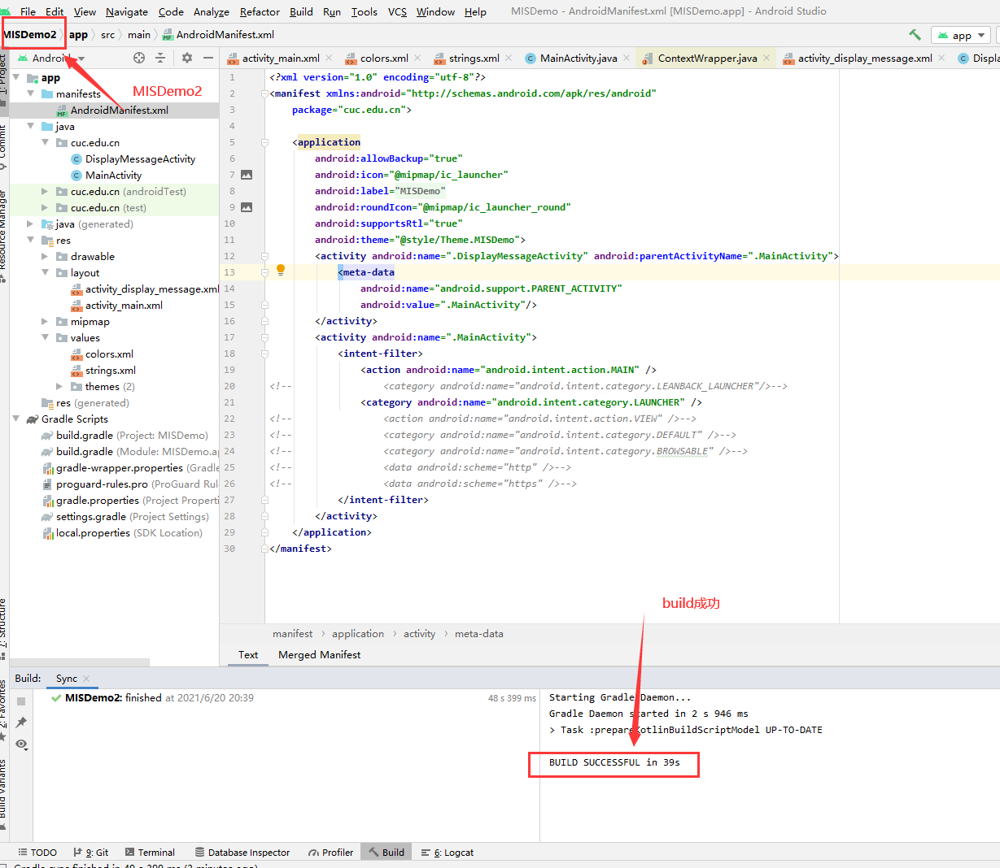

2. `Build` -> `Generate Signed APK...`，生成发布版apk，文件位于项目根目录下相对路径：`app/release/app-release.apk`；

   ​	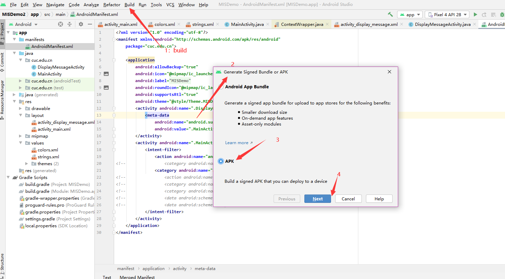

   ​	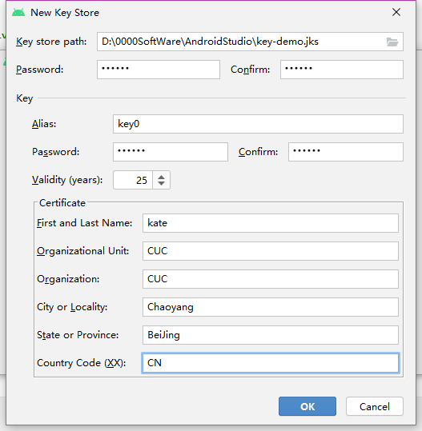

   ​	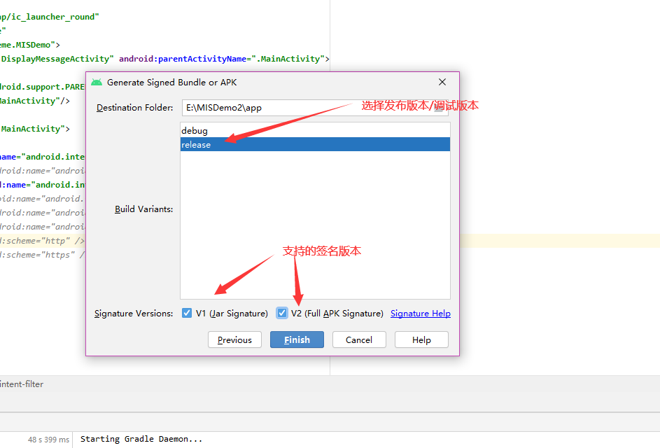

    	生成的apk文件：

   ​	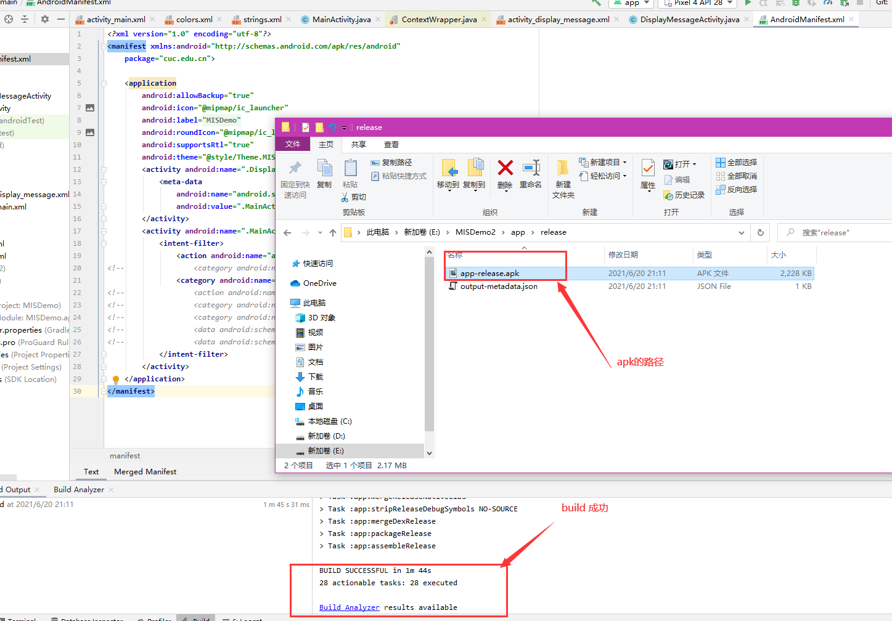

3. 配置`apktool`的环境

   + 下载[`apktool.jar`](https://raw.githubusercontent.com/iBotPeaches/Apktool/master/scripts/windows/apktool.bat)和[`apktool.bat`](https://raw.githubusercontent.com/iBotPeaches/Apktool/master/scripts/windows/apktool.bat)到同一目录;
   + 执行`apkbat.bat`；
   + 将`apktool.jar`所在目录添加到环境变量。

   ```bash
   # 在app-release.apk文件所在目录执行如下命令
   # 确认 apktool 在系统 PATH 环境变量中可找到
   apktool d app-release.apk
   ```

4. `apktool`反编译过程如下，反编译成功后，会在当前目录下生成apk文件名命名的一个独立目录。

   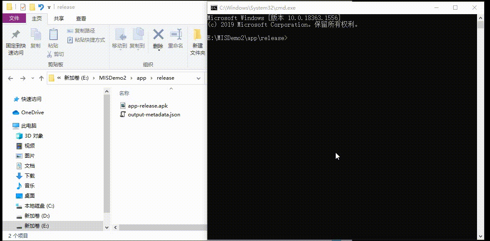

   反汇编出来的`smali`代码位于apktool输出目录下的 **smali** 子目录，源代码目录中的 **res** 目录也位于输出目录的一级子目录下。

5. 在模拟器MISDemo中运行，输入注册码错误时的提示信息页面如下。注意到其中的提示消息内容为：**注册失败**。依据此**关键特征**，在反汇编输出目录下进行**关键字查找**，可以在 `res/values/strings.xml` 中找到该关键字的注册变量名为`register_failed`。

   ```bash
   grep '注册失败' -R . 
   ./res/values/strings.xml:    <string name="register_failed">注册失败</string>
   ```

   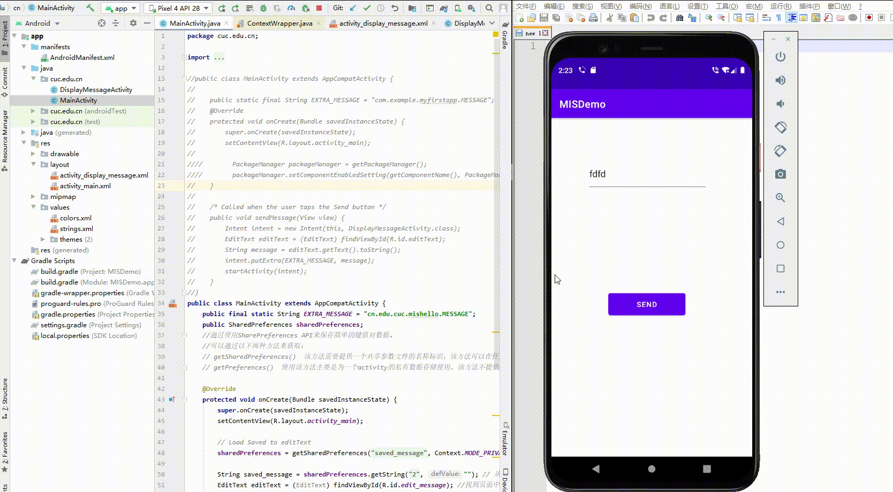

6. 用文本编辑器打开 `res/values/strings.xml` 查看会在上述代码行下一行发现：

   ```xml
   <string name="register_ok">注册成功</string>
   ```

   继续在反汇编输出目录下进行**关键字查找**：`register_ok`，可以发现

   ```smali
   ./smali/cn/edu/cuc/misdemo/R$string.smali:.field public static final register_ok:I = 0x7f060027
   ```
   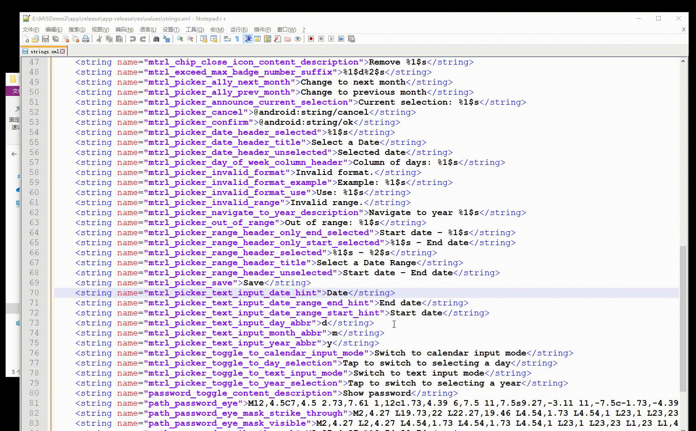

7. 现在，我们有了`register_ok`的资源唯一标识符：`0x7f060027`，使用该唯一标识符进行关键字查找，我们可以定位到这一段代码：

   ```
   ./smali/cn/edu/cuc/misdemo/DisplayMessageActivity.smali:    const v5, 0x7f060027
   ```
   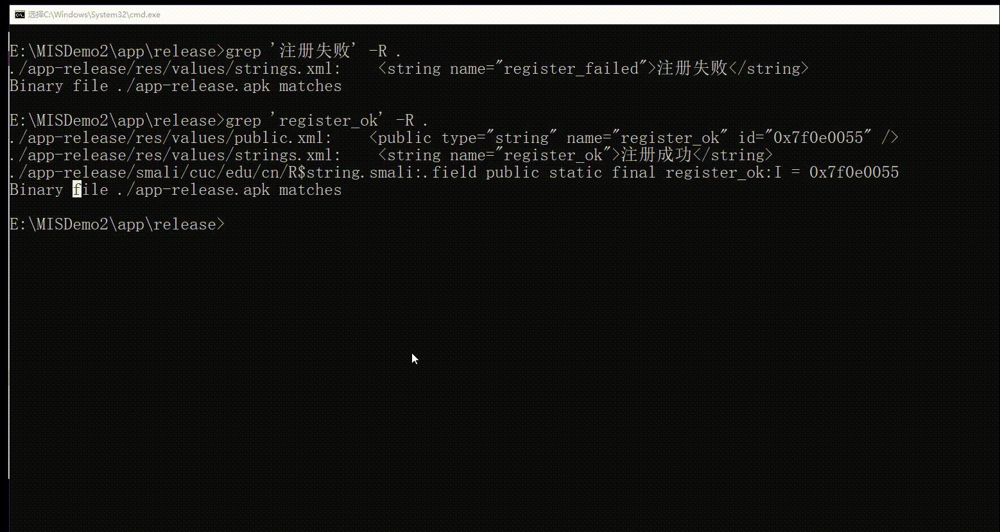用文本编辑器（本书使用[atom](https://atom.io/))打开上述`DisplayMessageActivity.smali`，定位到包含该资源唯一标识符所在的代码行。同时，在Android Studio中打开`DisplayMessageActivity.java`源代码，定位到包含`textView.setText(getString(R.string.register_ok));`的代码行。

   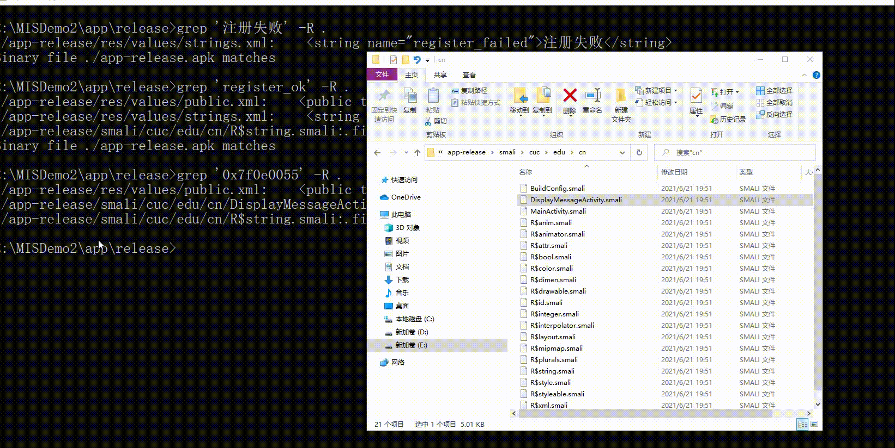

   

8. 根据源代码行号和smali代码中的`.line 39`，我们可以找到Android源代码中的Java代码和Smali代码之间的对应“翻译”关系。上述smali代码注释说明如下：

   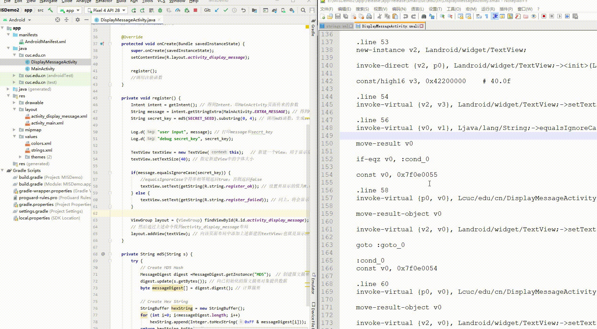

```
# 当前smali代码对应源代码的行号
.line 39

# 将 0x7f060027 赋值给寄存器v6
const v5, 0x7f060027

# invoke-virtual 是调用实例的虚方法（该方法不能是 private、static 或 final，也不能是构造函数）
# 在非static方法中，p0代指this
# 此处的实例对象是 cn.edu.cuc.misdemo.DisplayMessageActivity
# Lcn/edu/cuc/misdemo/DisplayMessageActivity; 表示DisplayMessageActivity这个对象实例 getString是具体方法名
# I表示参数是int类型
# Ljava/lang/String; 表示 Java内置的String类型对象
# 整个这一行smali代码表示的就是 调用 cn.edu.cuc.misdemo.DisplayMessageActivity对象的getString方法，传入一个整型参数值，得到String类型返回结果
invoke-virtual {p0, v5}, Lcn/edu/cuc/misdemo/DisplayMessageActivity;->getString(I)Ljava/lang/String;

# 将最新的 invoke-kind 的对象结果移到指定的寄存器中。该指令必须紧跟在（对象）结果不会被忽略的 invoke-kind 或 filled-new-array 之后执行，否则无效。
# 其中 kind 典型取值如virtual、super、direct、static、interface等，详见Android开源官网的 'Dalvik 字节码' 说明文档
move-result-object v5

# 此处的v4赋值发生在 .line 37，需要注意的是这里的v4是一个局部变量（用v表示），并不是参数寄存器（用p表示）。
# 当前initView()方法通过 .locals 定义了8个本地寄存器，用于保存局部变量，如下2行代码所示：
# .method private initView()V
#    .locals 8
# V 表示 setText 的返回结果是 void 类型
invoke-virtual {v4, v5}, Landroid/widget/TextView;->setText(Ljava/lang/CharSequence;)V
```


9. 搞懂了上述smali代码的含义之后，我们破解这个 **简单注册小程序** 的思路可以归纳如下：

   + 改变原来的注册码相等条件判断语句，对布尔类型返回结果直接取反，达到：只要我们没有输入正确的验证码，就能通过验证的“破解”效果；

     + 将 `if-eqz` 修改为 `if-nez`

       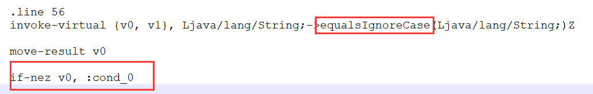

   + 在执行注册码相等条件判断语句之前，打印出用于和用户输入的注册码进行比较的“正确验证码”变量的值，借助`adb logcat`直接“偷窥”到正确的验证码；

     + 增加2行打印语句:

       ```
       //        Log.d("user input", message); // 打印message和secrt_key
       //        Log.d("debug secret_key", secret_key);
       
           .line 50
           invoke-static {v2, v0}, Landroid/util/Log;->d(Ljava/lang/String;Ljava/lang/String;)I
       
           const-string v2, "debug secret_key"
       
           .line 51
           invoke-static {v2, v1}, Landroid/util/Log;->d(Ljava/lang/String;Ljava/lang/String;)I
       
       ```


​						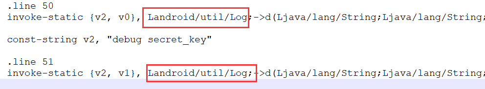

上述2种思路都需要直接修改smali代码，然后对反汇编目录进行**重打包**和**重签名**。

### 重打包

```bash
apktool b app-release
```

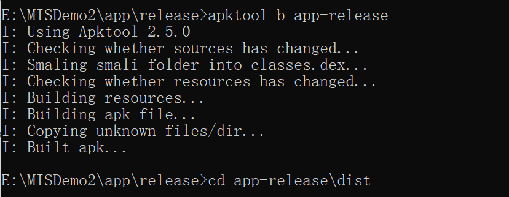

### 重签名

```bash
cd app-release/dist/
<Android SDK Path>/build-tools/<valid version code>/apksigner sign --min-sdk-version 19 --ks <path to release.keystore.jks> --out app-release-signed.apk app-release.apk
```

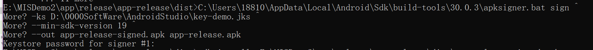

安装：

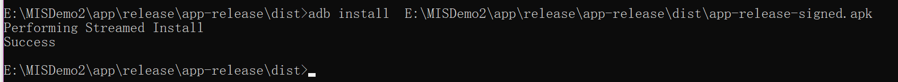

### 破解效果展示

直接通过“取反”注册码判断逻辑修改后的APK运行和使用效果如下动图所示：


通过**插桩**打印语句方式实现的直接“偷窥”正确注册码方法修改后的APK运行和使用效果如下动图所示：


## 实验问题解答

- [x] 使用apktool反汇编上一章实验中我们开发的Hello World v2版程序，对比Java源代码和smali汇编代码之间的一一对应关系。

  见上述`smali代码分析`第九步。

+ [x] 对Hello World v2版程序生成的APK文件进行程序图标替换，并进行重打包，要求可以安装到一台未安装过Hello World v2版程序的Android模拟器中。

  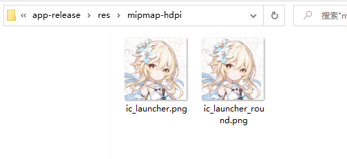

  

+ [x] 尝试安装重打包版Hello World v2到一台已经安装过原版Hello World v2程序的模拟器中，观察出错信息并解释原因。

+ [x] 去掉Hello World v2版程序中DisplayMessageActivity.java代码中的那2行日志打印语句后编译出一个新的apk文件，假设文件名是：misdemo-v3.apk，尝试使用课件中介绍的几种软件逆向分析方法来破解我们的认证算法。

## 试验问题

+ 无

##  参考资料

+ [黄大课件](https://c4pr1c3.github.io/cuc-mis/chap0x07/exp.html)

  

