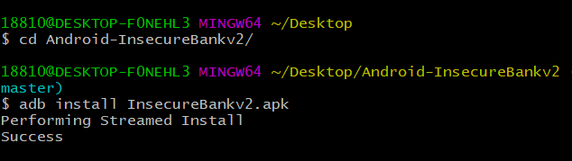

`pip2 install -r requirements.txt `

用pipenv 需要Python的环境

可以使用kali可以直接使用pipenv安装，使用python2启动服务器

+ 客户端：adb install InsecureBankv2.apk.即可在模拟器中启动一个，首次使用的时候需要改变一下连接的ip地址。

  + 账号和密码可以在github上查看。

    ```
    账号：jack
    密码：Jack@123$
    ```

    

  + 使用：`adb shell  am start -n com.androidd.insecurebankv2/.PostLogin`，是因为`exported:true`的原因。将`exported="false"`则可以修复这个漏洞。

+ 下载仓库


+ 启动客户端：




+ 启动服务器端：

  ```bash
  // 使用conda下载python2
  conda create -n androidLabServerPython2 python=2.0
  
  // 使用pipenv或者pip2下载requirements.txt中相关的包 
  pipenv install -r requirements.txt --two
  
  // 切换到服务器相关代码的目录
  cd AndroLabServer
  
  // 运行app.py 启动后端服务器
  python app.py
  ```

  

  

