# Android 缺陷应用漏洞攻击实验

## 实验目的

+ 理解 Android 经典的组件安全和数据安全相关代码缺陷原理和漏洞利用方法；
+ 掌握 Android 模拟器运行环境搭建和 `ADB` 使用；

## 实验环境

+ [Android-InsecureBankv2](https://github.com/c4pr1c3/Android-InsecureBankv2)

## 实验要求

- [x] 详细记录实验环境搭建过程；
- [x] 至少完成以下实验：
  - [x] Developer Backdoor
  - [x] Insecure Logging
  - [x] Android Application patching + Weak Auth
  - [x] Exploiting Android Broadcast Receivers
  - [x] Exploiting Android Content Provider

- [ ] （可选）使用不同于Walkthroughs中提供的工具或方法达到相同的漏洞利用攻击效果；
  - 推荐 [drozer](https://github.com/mwrlabs/drozer)

## 实验环境搭建

### 下载仓库

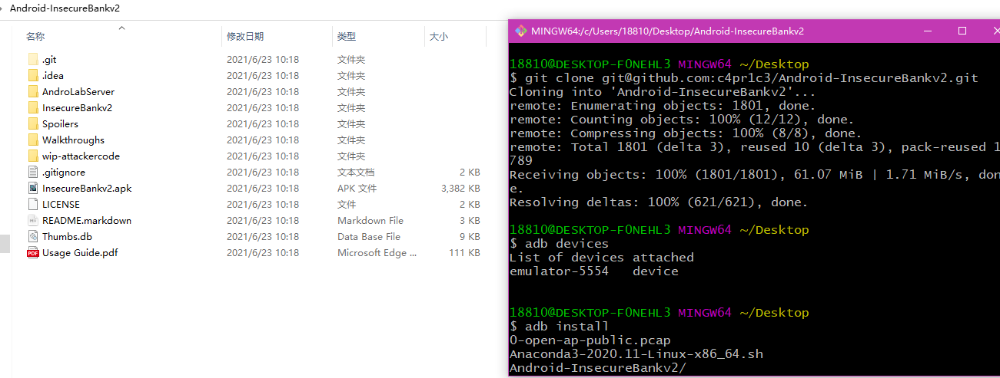

### 启动客户端


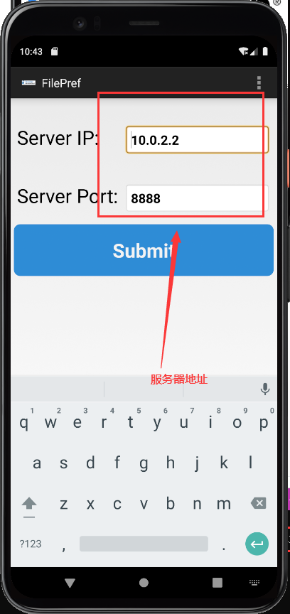


### 启动服务器

```bash
// 使用conda下载python2.7
conda create -n androidLabServerPython2 python=2.7

// 使用pip或者conda下载requirements.txt中相关的包 
pip install -r requirements.txt

// 切换到服务器相关代码的目录
cd AndroLabServer

// 运行app.py 启动后端服务器
python app.py
```

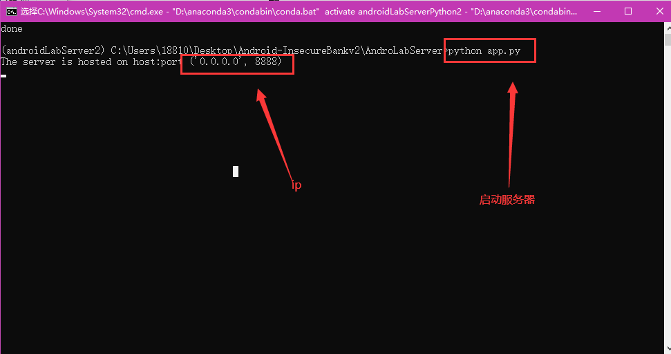

### 前后端连接

使用下述账户密码登录：

```
账号：jack
密码：Jack@123$
```


+ 使用：`adb shell  am start -n com.androidd.insecurebankv2/.PostLogin`，是因为`exported:true`的原因。将`exported="false"`则可以修复这个漏洞。

## 实验过程

### Developer Backdoor

#### 环境配置

1. 下载`https://github.com/dineshshetty/Android-InsecureBankv2`：

   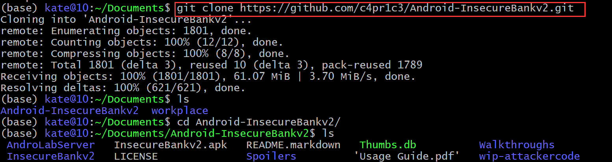

2. 下载安装[`jadx`](https://github.com/skylot/jadx)：

   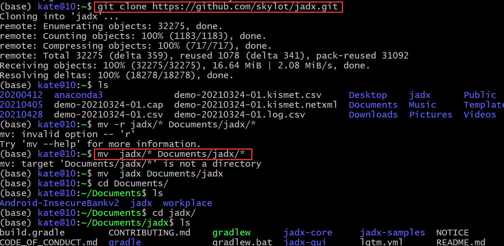

   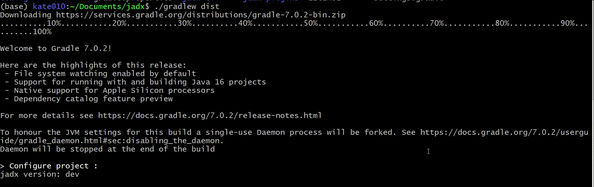

3. 下载[dex2jar](https://bitbucket.org/pxb1988/dex2jar/downloads///https://gitlab.com/kalilinux/packages/dex2jar/):

   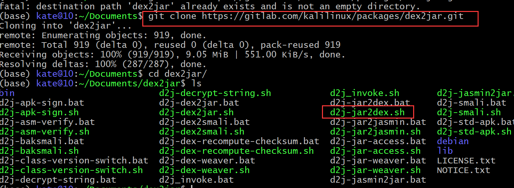

#### 实验过程

1. 解压`InsecureBankv2.apk`;

   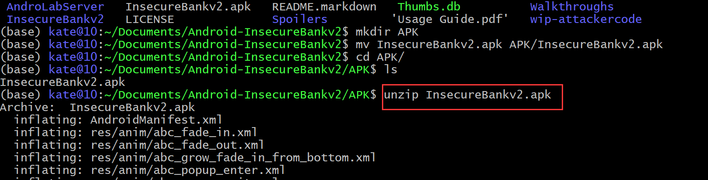

2. 将` classes.dex `拷贝到`dex2jar` ,为`d2j-dex2jar.sh` 和`d2j_invoke.sh` 可执行；

   ```
   cp classes.dex  ../../dex2jar/
   cd ../../dex2jar/
   chmod +x d2j-dex2jar.sh
   chmod +x d2j_invoke.sh
   sh d2j-dex2jar.sh classes.dex
   ```

   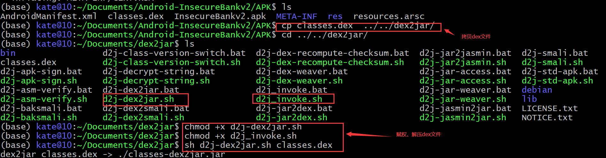

3. 使用`jadx GUI`打开生成的jar文件

   ```bash
    ./jadx-gui  ../../../../dex2jar/classes-dex2jar.jar
   ```

   

### Insecure Logging

#### 环境配置

1. `Android Studio`下载，见第五章实验报告。

#### 实验过程

1. 在`Android Studio`目录下使用`apk`向模拟器安装`C:\Users\18810\Desktop\Android-InsecureBankv2\InsecureBankv2.apk`；

   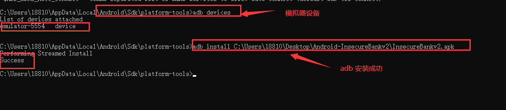

2. `apk logcat`；

3. 打开模拟器上的`APP`:`InsecureBankv2`；

   

4. 成功登录

   ​	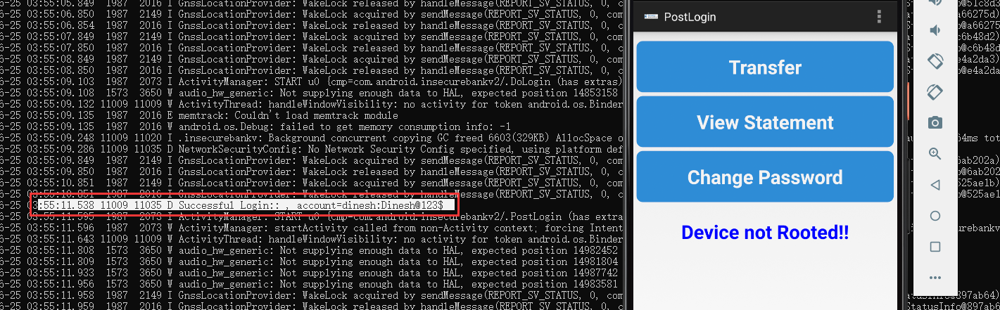

5. 修改密码

   ​	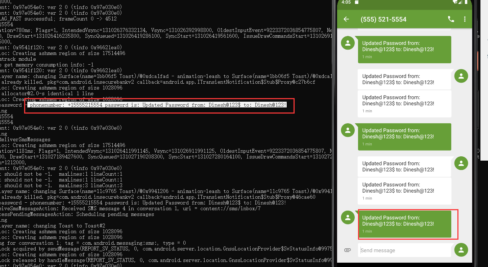

### Android Application patching + Weak Auth

#### 环境配置

1. 安装`Android Studio`
2. 安装`apktool`
3. 安装`sign`文件

#### 实验过程

1. 解压`InsecureBankv2.apk`：

   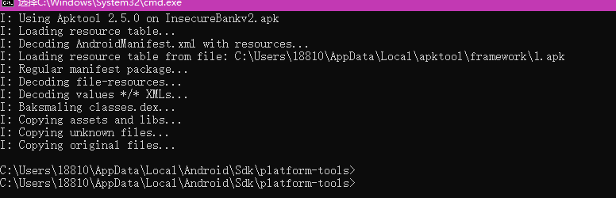

2. 打开`InsecureBankv2/res/values/strings.xml `,将`is_admin`的值改成`yes`；

   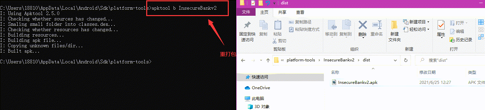

3. 重新编译`InsecureBankv2`文件

   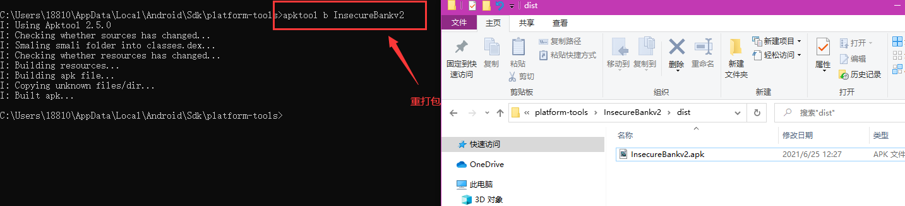

4. 使用`SignApk`对新生成`apk`文件进行签名:`java -jar sign.jar InsecureBankv2.apk`

5. 使用`apk` 安装签名完的`apk`包：`adb install InsecureBankv2.s.apk`

6. 查看模拟器，发现有一个新的按钮`Create User`，可以用这个按钮创建一个新的用户

   

### Exploiting Android Broadcast Receivers

#### 环境配置


#### 实验过程


### Exploiting Android Content Provider

#### 环境配置

#### 实验过程

## 实验问题

+ `jadx`运行出错：

  + 原因：`java`安装有问题。

    

  + 解决方法 ：卸载重装`javajdk`即可。

    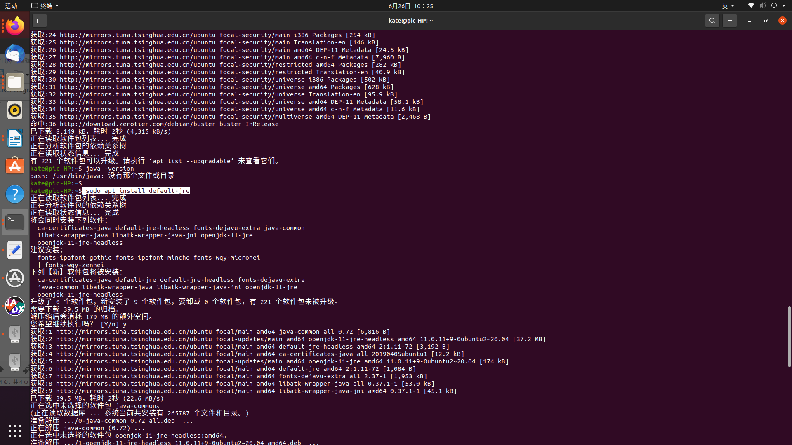

