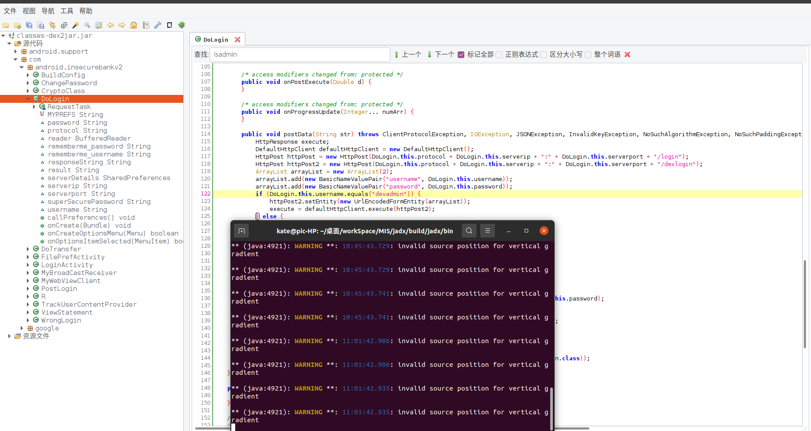
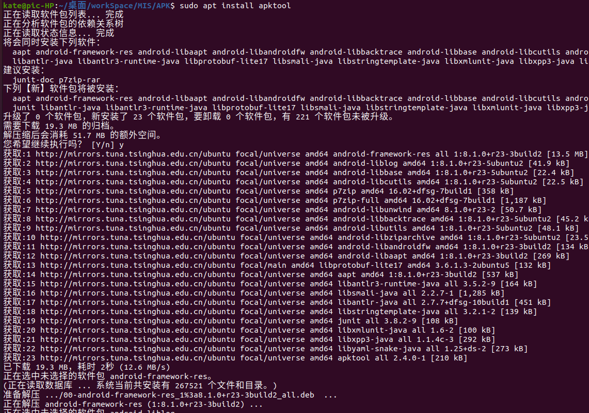
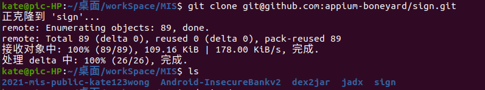
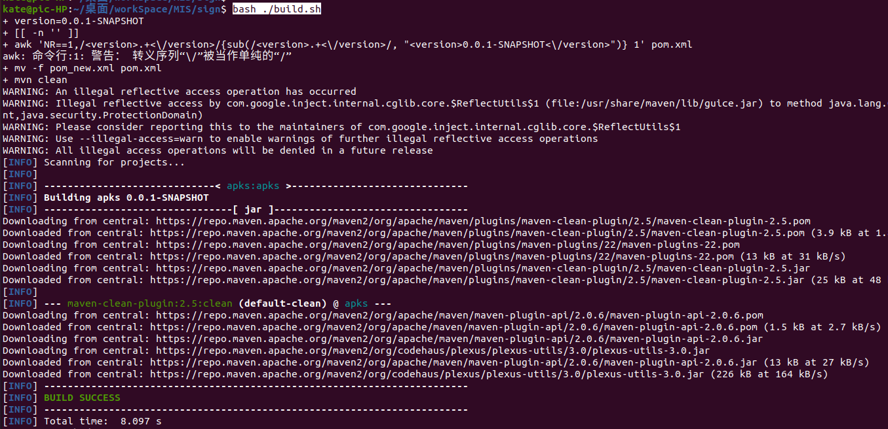
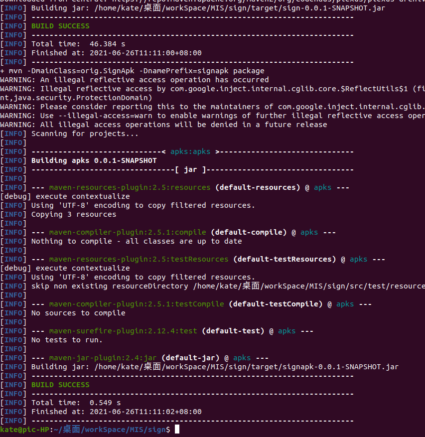
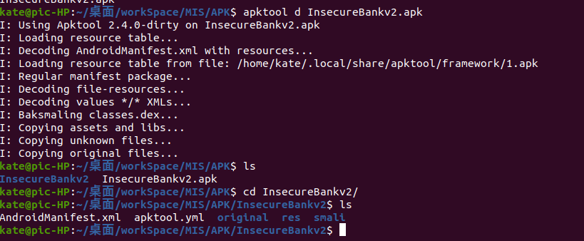
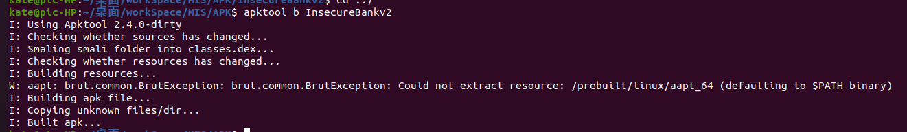

# Android 缺陷应用漏洞攻击实验

## 实验目的

+ 理解 Android 经典的组件安全和数据安全相关代码缺陷原理和漏洞利用方法；
+ 掌握 Android 模拟器运行环境搭建和 `ADB` 使用；

## 实验环境

+ [Android-InsecureBankv2](https://github.com/c4pr1c3/Android-InsecureBankv2)

## 实验要求

- [x] 详细记录实验环境搭建过程；
- [x] 至少完成以下实验：
  - [x] Developer Backdoor
  - [x] Insecure Logging
  - [x] Android Application patching + Weak Auth
  - [x] Exploiting Android Broadcast Receivers
  - [x] Exploiting Android Content Provider

- [ ] （可选）使用不同于Walkthroughs中提供的工具或方法达到相同的漏洞利用攻击效果；
  - 推荐 [drozer](https://github.com/mwrlabs/drozer)

## 实验环境搭建

### 下载仓库


### 启动客户端


### 启动服务器

```bash
// 使用conda下载python2.7
conda create -n androidLabServerPython2 python=2.7

// 使用pip或者conda下载requirements.txt中相关的包 
pip install -r requirements.txt

// 切换到服务器相关代码的目录
cd AndroLabServer

// 运行app.py 启动后端服务器
python app.py
```


### 前后端连接

使用下述账户密码登录：

```
账号：jack
密码：Jack@123$
```


## 实验过程

### Developer Backdoor

#### 环境配置

1. 下载`https://github.com/dineshshetty/Android-InsecureBankv2`：

   

2. 下载安装[`jadx`](https://github.com/skylot/jadx)：

   

   

3. 下载[dex2jar](https://bitbucket.org/pxb1988/dex2jar/downloads///https://gitlab.com/kalilinux/packages/dex2jar/):

   

#### 实验过程

1. 解压`InsecureBankv2.apk`;

   

2. 将` classes.dex `拷贝到`dex2jar` ,为`d2j-dex2jar.sh` 和`d2j_invoke.sh` 可执行；

   ```
   cp classes.dex  ../../dex2jar/
   cd ../../dex2jar/
   chmod +x d2j-dex2jar.sh
   chmod +x d2j_invoke.sh
   sh d2j-dex2jar.sh classes.dex
   ```

   

3. 使用`jadx GUI`打开生成的jar文件,在`DoLgin`中我们发现，用户`devadmin`进入的是一个不同与其他用户的界面。实验发现可以使用这个用户账号可以用任意一个密码登陆到`app`中。

   ```bash
    ./jadx-gui  ../../../../dex2jar/classes-dex2jar.jar
   ```

   
   
   

### Insecure Logging

#### 环境配置

1. `Android Studio`下载，见第五章实验报告。

#### 实验过程

1. 在`Android Studio`目录下使用`apk`向模拟器安装`C:\Users\18810\Desktop\Android-InsecureBankv2\InsecureBankv2.apk`；

   

2. `apk logcat`；

3. 打开模拟器上的`APP`:`InsecureBankv2`；

   

4. 成功登录

   ​	

5. 修改密码

   ​	

### Android Application patching + Weak Auth

#### 环境配置

1. 安装`Android Studio`

2. 安装`apktool`

   

3. 安装`sign`文件

   

   

   

#### 实验过程

1. 解压`InsecureBankv2.apk`：

   `./apktool d InsecureBankv2.apk`

   

2. 打开`InsecureBankv2/res/values/strings.xml `,将`is_admin`的值改成`yes`；

   

3. 重新编译`InsecureBankv2`文件

   

4. 使用`SignApk`对新生成`apk`文件进行签名:`java -jar sign.jar InsecureBankv2.apk`

   `java -jar ./sign*.jar ./InsecureBankv2.apk `

   

5. 使用`apk` 安装签名完的`apk`包：`adb install InsecureBankv2.s.apk`

   

6. 查看模拟器，发现有一个新的按钮`Create User`，可以用这个按钮创建一个新的用户

   

### Exploiting Android Broadcast Receivers

#### 环境配置

1. `jadx`、`dex2jar`、`APKtool`

   

   

#### 实验过程

1. 模拟器安装`InsecureBankv2.apk`:`adb install InsecureBankv2.apk`；运行模拟器；使用`dinesh`登陆。

2. 解压`InsecureBankv2.apk`:`apktool d InsecureBankv2.apk`;

   

   

3. `AndroidManifest.xml` 文件中的`Broadcast receiver `定义如下：

   

4. 使用`unzip`解压`apk`文件，得到`classes.dex`,再使用`dex2jar`解压`classes.dex`文件，得到`classes-dex2jar.jar `。用`jadx-gui`打开该文件。

   

   

5. 下图是打开的`jadx`中传递到`Broadcast Receiver`中的参数：

   

   


6. 使用`adb sehll`进入`shell`目录；使用`am broadcast -a theBroadcast -n com.android.insecurebankv2/com.android.insecurebankv2.MyBroadCastReceiver  --es phonenumber 5554 –es newpass   `命令。如下图可见，执行这条命令时，向5554发送了一条信息。（对应上文中`sendTextMessage`函数）


### Exploiting Android Content Provider

#### 环境配置

+ 与上述实验雷同，此处略。

#### 实验过程

1. 同上述几个实验部分：`adb  install` apk文件、使用`dinesh\Dinesh@123$`登陆、`apktool d  InsecureBankv2.apk`反编译、`unzip InsecureBankv2.apk`解压apk文件、`sh d2j-dex2jar.sh classes.dex`使用将`dex2jar`转换成`classes-dex2jar.jar`、使用`jadx-gui`打开转换生成的`jar`文件。（图略，参见上述几个实验）

2. 打开`unzip`得到的`AndroidManifest.xml `:可知`com.android.insecurebankv2.TrackUserContentProvider"`包名。

   

3. 查看使用`jadx-gui`打开的反编译文件中给上述页面传递的参数：

   

4. 执行命令：`content query --uri content://com.android.insecurebankv2.TrackUserContentProvider/trackerusers`，得到：

   		

## 实验问题

+ `jadx`运行出错：

  + 原因：`java`安装有问题。

  + 解决方法 ：卸载重装`javajdk`即可。

    

+ `sign`测试出错

  

  + 原因：`jarsigner`未找到

  + 解决方法：安装`openjdk-11-jdk-headless`

    

    ​		

+ `sign`时签名命令`java -jar sign.jar InsecureBankv2.apk`执行报错，找不到`sign.jar`文件。

  + 解决方法：观察`test.sh`文件，发现使用`jarsigner`和`java jar ./target/sign*.jar`来对目标文件进行签名。所以手动使用这两条命令对目标文件进行签名。

    
    
    

## 参考文献

+ [Android-InsecureBankv2](https://github.com/c4pr1c3/Android-InsecureBankv2/tree/master/Walkthroughs)

